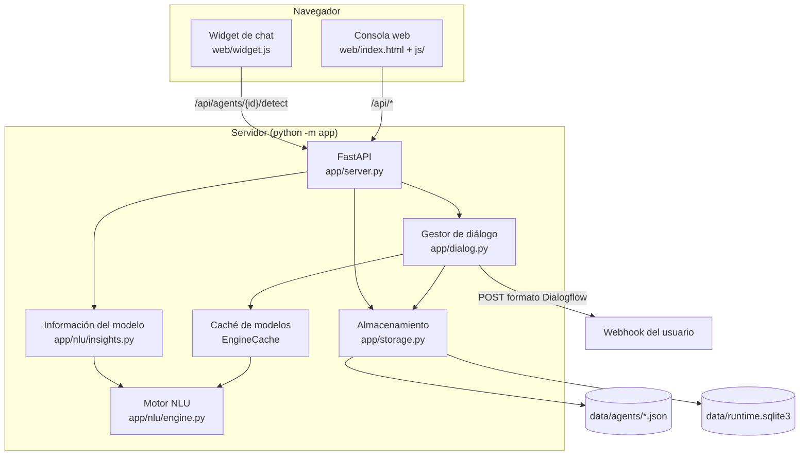

# Arquitectura y guía para desarrolladores

Todo lo necesario para entender el código y seguir desarrollándolo: cómo está organizado, cómo
funciona cada pieza, qué formato tienen los datos y por qué se tomó cada decisión. Para *usar* la
aplicación, mejor la [guía de uso](docs/GUIA.md).

> GitHub muestra este fichero en la pestaña **Contributing** de la portada del repositorio (solo
> admite pestañas con nombres fijos: README, LICENSE, CONTRIBUTING, CODE_OF_CONDUCT y SECURITY).

## Cómo desarrollar

1. Prepara el entorno:

   ```bash
   python -m venv .venv
   .venv\Scripts\activate          # Linux/macOS: source .venv/bin/activate
   pip install -r requirements-dev.txt
   ```

2. Arranca la consola con `python -m app` (<http://localhost:8000>). Tras cambiar código Python
   reinicia el servidor; para los cambios en `web/` basta con recargar el navegador.
3. Antes de subir cambios, pasa las pruebas (detalles en [Pruebas](#pruebas)):
   - `python -m pytest`: deben pasar todas.
   - Si tocas la consola: `pip install playwright` y `python -m pytest tests/e2e -m e2e`.
   - Si tocas el clasificador: `python tools/benchmark_massive.py` y compara con 59 % (10 frases
     por intención) y 65,6 % (20 frases).
4. Convenciones:
   - identificadores en inglés; comentarios, textos de la interfaz y documentación en español;
   - sin dependencias pesadas (ni scikit-learn ni frameworks de JavaScript);
   - todo agente pasa por `normalize_agent()`; en la web el DOM se crea con `h()`, nunca con
     `innerHTML` a partir de datos del usuario;
   - commits en español que expliquen el cambio y el motivo.

## Visión general



- **Sin dependencias pesadas**: FastAPI, uvicorn, numpy, snowballstemmer (solo para inglés) y tzdata.
  El NLU es propio; no usa scikit-learn ni modelos descargables.
- **Sin paso de compilación** en la web: módulos ES nativos servidos tal cual.
- **Un modelo por agente**, entrenado en memoria y reentrenado de forma perezosa cuando cambia la
  versión del agente.

## Estructura de carpetas

| Ruta | Responsabilidad |
|---|---|
| `app/__main__.py` | Arranque: argumentos `--host --port --data --no-browser`, abre el navegador |
| `app/server.py` | `create_app(data_dir)`: todas las rutas, autenticación, ficheros estáticos (`/` = `web/`, `/guia` = `docs/`) |
| `app/storage.py` | Agentes en JSON (escritura atómica, versión incremental) y SQLite (logs y sesiones) |
| `app/agents.py` | `normalize_agent()` y compañía: todo lo que entra se limpia y completa aquí |
| `app/dialog.py` | `DialogManager.detect()`: un turno de conversación; `EngineCache` |
| `app/responses.py` | Formateo de valores y sustitución de `$param`, `#ctx.param` |
| `app/webhook.py` | Petición y respuesta del webhook en formato Dialogflow ES v2 |
| `app/importer.py` | Importar JSON propio o ZIP de Dialogflow ES |
| `app/validation.py` | Avisos de calidad (frases duplicadas, contextos huérfanos…) |
| `app/nlu/text.py` | `Tokenizer`, `Token`, normalización |
| `app/nlu/lang_es.py`, `lang_en.py` | Vocabulario por idioma (números, meses, abreviaturas, palabras de cancelar) |
| `app/nlu/languages.py` | Registro de idiomas y stemmers |
| `app/nlu/stemmer_es.py` | Stemmer Snowball español sobre texto sin tildes |
| `app/nlu/spelling.py` | Corrector SymSpell y distancia Damerau-Levenshtein |
| `app/nlu/sys_entities.py` | Entidades `@sys.*` (números, fechas, horas, duraciones, dinero…) |
| `app/nlu/entities.py` | Entidades propias (exacta, raíz, corregida, regex) |
| `app/nlu/common.py` | `EntityMatch` y resolución de solapamientos |
| `app/nlu/features.py` | Frase → rasgos (`w:`, `b:`, `e:`, `c:`, `p:`) |
| `app/nlu/classifier.py` | `Vectorizer` (TF-IDF por clases) e `IntentClassifier` (regresión logística SGD + similitud) |
| `app/nlu/engine.py` | `NLUEngine`: entrenamiento, `analyze()`, plantillas, parámetros, auto-anotación, informe |
| `app/nlu/insights.py` | Rasgos por intención, mapa t-SNE, explicación de una frase, validación cruzada |
| `web/js/app.js` | Estado global, rutas por `#hash`, barra lateral, tema |
| `web/js/ui.js` | `h()` (crea DOM sin `innerHTML`), iconos, modales, avisos, chips, popovers |
| `web/js/annotate.js` | Frase anotable: seleccionar texto → elegir entidad |
| `web/js/charts.js` | Gráficos SVG/HTML: línea, barras, barras divergentes, puntos, matriz, medidor |
| `web/js/markdown.js` | Intérprete mínimo de Markdown (para la guía) |
| `web/js/simulator.js` | Panel «Pruébalo» |
| `web/js/pages/*.js` | Una página por sección de la consola |
| `web/widget.js` | Widget incrustable (Shadow DOM, sin dependencias) |

## Formato de un agente

Fichero `data/agents/<id>.json` (ver `examples/pizzeria.json`). Todo pasa por
`app/agents.py:normalize_agent()` antes de guardarse.

```json
{
  "id": "pizzeria",
  "name": "Pizzería (ejemplo)",
  "language": "es",
  "timezone": "Europe/Madrid",
  "settings": {
    "threshold": 0.3, "defaultLifespan": 5, "spellCorrection": true,
    "normalization": {"pizzeta": "pizza"},
    "webhook": {"url": "", "headers": {}, "timeout": 5},
    "apiKey": ""
  },
  "entities": [
    {"id": "e001", "name": "tamano", "kind": "map", "fuzzy": true, "autoExpand": false,
     "entries": [{"value": "familiar", "synonyms": ["familiar", "grande", "XL"]}]}
  ],
  "intents": [
    {
      "id": "i019", "name": "pedido.pizza", "isFallback": false,
      "events": [], "inputContexts": [],
      "outputContexts": [{"name": "pedido", "lifespan": 5}],
      "resetContexts": false, "action": "pedido.crear",
      "parameters": [{"id": "a1", "name": "tamano", "entity": "@tamano", "required": true,
                      "isList": false, "prompts": ["¿De qué tamaño?"], "defaultValue": ""}],
      "trainingPhrases": [{"id": "p1", "text": "una margarita familiar",
                           "annotations": [{"start": 4, "end": 13, "entity": "@pizza", "param": "pizza"}]}],
      "responses": [{"type": "text", "variants": ["Marchando $pizza ($tamano)"]},
                    {"type": "quickReplies", "items": ["A domicilio", "Para recoger"]}],
      "webhook": false, "endConversation": false
    }
  ],
  "version": 7, "updatedAt": 1790844802.6
}
```

- `kind` de entidad: `map` (valor + sinónimos), `list` (solo valores), `regex`.
- `annotations: null` en una frase significa «anotar automáticamente al entrenar».
- Anotar una entidad crea el parámetro si no existe (`normalize_intent`).
- `version` sube en cada guardado; la caché de modelos la usa para saber cuándo reentrenar.

SQLite (`data/runtime.sqlite3`):

- `logs`: un registro por turno (texto, intención, confianza, parámetros, respuesta, análisis
  compacto y estado de revisión `pending|approved|corrected|ignored|none`). Los turnos de slot
  filling, cancelación y eventos se guardan con `none` (no son frases útiles para entrenar).
- `sessions`: estado de cada conversación (contextos, parámetro pendiente). Caduca a los 20 min.

## El motor de lenguaje (NLU)

### Tokenización y normalización (`text.py`)

Una expresión regular reconoce, por orden: URL, email, hora `17:30`, fecha `15/03/2026`, número
`1.000,5`, palabra y símbolo. Cada `Token` guarda el texto original y su posición (para resaltar),
la forma normalizada (`casefold`, sin tildes, ñ→n, «holaaaa»→«hola», risas→«jaja»), la raíz y una
posible corrección. Las abreviaturas de chat (`lang_es.ABBREVIATIONS`) y las reglas del agente
(`settings.normalization`) pueden expandir un token en varios («xfa» → «por», «favor»), todos con
la misma posición.

### Raíces (`stemmer_es.py`)

Algoritmo Snowball español adaptado a texto **sin tildes**: así «cancelación» y «cancelacion» dan
la misma raíz. Ajustes propios: los plurales en `-des`, `-ares`, `-eres`, `-ires` se reducen antes
(ciudades → ciudad → «ciud», familiares → familiar → «famil»), y `-io/-ios` se tratan igual.

### Corrección ortográfica (`spelling.py`)

SymSpell con índice de borrados. Distancia máxima 1 (2 en palabras de 9+ letras). Solo corrige
palabras de 4+ letras que no están en el vocabulario (frases de entrenamiento, sinónimos y palabras
de fechas/números). **No cambia la primera letra** salvo la «h» muda («abla» → «habla»): sin esta
regla «apaga» se corregía a «paga».

### Entidades del sistema (`sys_entities.py`)

Analizadores escritos a mano sobre los tokens normalizados: números en cifra y en palabras
(«doscientos treinta y cinco»), ordinales, porcentajes, dinero, duraciones, fechas relativas y
absolutas (hoy, pasado mañana, el lunes que viene, el 15 de marzo, dentro de 3 días, el finde,
Navidad), horas («las 5 y cuarto de la tarde», «a la una menos cuarto», «21h»), fecha+hora, email,
URL y teléfono. Decisiones:

- «a las N» sin calificador: 1-7 → tarde (17:00), 8-12 tal cual.
- «un/una» son números **débiles**: solo rellenan un parámetro `@sys.number` si no hay otro número.
- «las dos pizzas» no es una hora: si tras «las N» viene una palabra que no es de hora/fecha, se descarta.

### Entidades propias (`entities.py`)

Índice de secuencias de tokens. Para cada posición se busca la secuencia más larga que coincida, por
orden: forma exacta (confianza 1), raíz en palabras de 4+ letras (plurales y género, 0,95), forma
corregida (solo si la entidad tolera faltas, 0,85) y expresiones regulares. `resolve_overlaps()`
elige un conjunto sin solapamientos: primero lo más largo; a igual longitud, entidades propias
exactas antes que las del sistema y los números al final.

### Rasgos (`features.py`)

Las entidades elegidas se sustituyen por su tipo y la frase se convierte en rasgos con peso:

| Rasgo | Ejemplo | Peso |
|---|---|---|
| `w:` raíz de palabra | `w:reserv` | 1 (0,5 si está dentro de una entidad) |
| `b:` pareja de unidades seguidas | `b:quier_reserv`, `b:para_@sys.number` | 1 |
| `e:` entidad | `e:@sys.date` | 1 |
| `c:` trozo de 3-4 letras con bordes | `c:<re`, `c:serv`, `c:ar>` | 1 |
| `p:` signo de pregunta | `p:?` | 1 |

Los números sin entidad se representan como `#num`. Si una palabra se corrigió, se usa la forma
corregida.

### Vectorización (`classifier.py: Vectorizer`)

TF-IDF con **IDF por intención** (no por frase): `idf = ln((1 + K) / (1 + nº de intenciones que
usan el rasgo)) + 1`, con `K` intenciones. Así una palabra frecuente dentro de una sola intención
sigue pesando mucho. TF sublineal (`1 + ln tf`). El bloque de palabras/parejas/entidades y el de
trozos de letras se normalizan por separado (L2) y se combinan con pesos √0,55 y √0,45: el coseno
entre dos frases es `0,55·cos(palabras) + 0,45·cos(letras)`.

### Clasificador (`classifier.py: IntentClassifier`)

1. **Regresión logística multiclase (softmax)** entrenada con SGD: 15 épocas, tasa 0,5 con
   decaimiento `0,5 / (1 + 0,02·época)`, regularización L2 1e-4, orden aleatorio con semilla fija
   (resultados reproducibles). Las frases del fallback forman la clase `__fallback__:<id>`. Se guarda
   la curva de aprendizaje (error y acierto tras cada época sobre una muestra de hasta 400 frases).
2. **Similitud**: índice invertido sobre los vectores de entrenamiento; para cada intención,
   `sim = max(0,7·top1 + 0,3·top2, coseno con el centroide)`.
3. **Probabilidad mezclada**: `0,85·p_logística + 0,15·softmax(sim / 0,1)`. Con pocas frases el
   vecino más parecido es una pista muy fiable.

### Decisión (`engine.py: NLUEngine.analyze`)

- Solo compiten las intenciones cuyos contextos de entrada están todos activos.
- La intención se **elige** por probabilidad mezclada (lo más preciso: +3 puntos en MASSIVE frente a
  ordenar por confianza).
- La **confianza** es `√p · min(1, sim / 0,65)²`, calibrada con `tests/casos_pizzeria.py` para usarse
  con umbral 0,3. Sin el factor de parecido, una frase fuera de tema puede salir con mucha
  probabilidad cuando hay pocas intenciones.
- Las intenciones con contexto de entrada reciben `conf·1,15 + 0,05` y, si su confianza es ≥ 0,5,
  ganan a las demás (como en Dialogflow).
- **Plantillas**: cada frase de entrenamiento se guarda como secuencia de raíces y entidades; si el
  mensaje coincide exactamente (las `@sys.any` son comodines), la confianza es 1,0 y los parámetros
  salen de la plantilla.

### Parámetros (`engine.py: extract_parameters`)

Por orden: valores de la plantilla exacta; candidatos del tipo de entidad que no estén dentro de otra
entidad elegida; si varios parámetros comparten tipo («de @ciudad a @ciudad»), se reparten por la
palabra anterior aprendida en las anotaciones; `@sys.any` sin plantilla se captura entre las anclas
izquierda/derecha aprendidas («me llamo [X]» → hasta el final; «quiero [X] para el sábado» → solo si
aparece «para»).

## Diálogo (`dialog.py`)

Un turno (`DialogManager.detect`):

1. Carga la sesión (o crea una nueva si caducó o terminó) y añade los contextos que mande el cliente.
2. Si había un **parámetro pendiente**: «cancelar» (solo si todo el mensaje son palabras de cancelar
   y de relleno) lo abandona; si el mensaje trae el valor, lo rellena (y otros que vengan); si no lo
   trae y otra intención supera 0,8, cambia de tema; si no, vuelve a preguntar.
3. Si no: evento → intención con ese evento; texto → `analyze` y umbral → intención o fallback (el
   fallback más específico para los contextos activos).
4. Valores por defecto (`#contexto.param`, `$otro`, literal), y si falta un obligatorio se pregunta
   uno de sus `prompts`.
5. Si está completa: contextos de salida (con los parámetros y `param.original`), respuesta
   (variante al azar), webhook si está activado y `endConversation`.
6. **Duración de los contextos**: al final del turno los contextos previos pierden 1 turno; los
   puestos en este turno conservan su duración completa; 0 = borrar; `resetContexts` borra los previos.
7. Guarda la sesión y el registro, y devuelve el resultado (con el análisis completo si `debug`).

El **webhook** recibe `queryResult` (texto, acción, parámetros, contextos con nombre completo
`projects/<agente>/agent/sessions/<sesión>/contexts/<nombre>`, intención, confianza) y puede devolver
`fulfillmentText`, `fulfillmentMessages` (text, quickReplies, payload, card), `outputContexts`,
`payload` o `followupEventInput` (lanza otra intención por evento; máximo 3 encadenados). Si falla,
se usa la respuesta estática.

## API

Documentación interactiva en `/docs`. Resumen:

| Método y ruta | Uso |
|---|---|
| `GET /api/info` | Versión, idiomas, entidades del sistema, si hace falta token |
| `GET/POST /api/agents`, `POST /api/agents/import` | Listar, crear, importar (JSON o ZIP de Dialogflow) |
| `GET/PATCH/DELETE /api/agents/{id}` | Leer, cambiar ajustes, borrar |
| `GET /api/agents/{id}/export`, `POST .../duplicate` | Exportar JSON, duplicar |
| `POST/PUT/DELETE /api/agents/{id}/intents[/{iid}]` | Intenciones (`.../phrases` añade una frase) |
| `POST/PUT/DELETE /api/agents/{id}/entities[/{eid}]` | Entidades (`.../synonyms` añade un sinónimo) |
| `POST /api/agents/{id}/annotate` | Anotación automática de una frase |
| `POST /api/agents/{id}/analyze` | Análisis sin sesión (tokens, entidades, ranking, parámetros) |
| `POST /api/agents/{id}/detect` | **Conversación** (`sessionId`, `text` o `event`, `contexts`, `debug`) |
| `POST /api/agents/{id}/sessions/{sid}/reset` | Empezar de cero |
| `POST /api/agents/{id}/train`, `GET .../status` | Reentrenar (devuelve el informe), estado |
| `GET /api/agents/{id}/model` | Informe, rasgos por intención, mapa de frases, último examen |
| `POST /api/agents/{id}/explain` | Recorrido completo de una frase |
| `POST /api/agents/{id}/evaluate` | Examen con validación cruzada (`folds`) |
| `GET /api/agents/{id}/validate` | Avisos de calidad |
| `GET /api/agents/{id}/logs`, `POST .../logs/{lid}/review` | Revisión: listar y aprobar/asignar/ignorar |
| `GET /api/agents/{id}/conversations[/{sid}]`, `GET .../stats` | Historial y estadísticas |
| `POST /v2/projects/{id}/agent/sessions/{sid}:detectIntent` | Compatible con Dialogflow ES |

Seguridad: si existe `AGENTE_ADMIN_TOKEN`, las rutas de administración (agentes, intenciones,
entidades, entrenamiento, revisión, historial) exigen `Authorization: Bearer <token>`. Las de
conversación (`detect`, `sessions/.../reset`, `public`, `:detectIntent`) y `/api/info` no; si el
agente tiene `apiKey`, esas rutas de conversación exigen la cabecera `X-Api-Key`.

## Información del modelo (`insights.py`)

- `top_features`: columnas de la matriz de pesos ordenadas; los rasgos se traducen a texto legible
  (la raíz se muestra con su palabra más frecuente gracias a `engine.stem_words`).
- `projection`: **t-SNE** (implementación compacta en numpy, perplejidad 20, 400 iteraciones,
  semilla fija) sobre las **puntuaciones del modelo** de cada frase, seguido de una **repulsión de
  corto alcance** que separa los puntos superpuestos. Se probaron alternativas (silueta de los grupos
  en el ejemplo): PCA sobre TF-IDF −0,21, PCA sobre puntuaciones 0,03, t-SNE sobre TF-IDF 0,04,
  t-SNE sobre puntuaciones 0,87 (pero con el 92 % de puntos superpuestos) y con repulsión 0,75 sin
  superposición. Hasta 700 frases (muestra estratificada). Una frase nueva se coloca en la media
  ponderada de sus 5 vecinos más cercanos en el espacio de puntuaciones.
- `explain`: tokens, entidades, rasgos con TF-IDF, ranking y, para las 3 primeras intenciones, la
  aportación de cada rasgo (`peso TF-IDF × peso aprendido`) más el sesgo.
- `evaluate`: validación cruzada estratificada (5 rondas por defecto), entrenando un `NLUEngine`
  completo por ronda y evaluando cada frase con los contextos de entrada de su intención activos.

## Consola web

- `h(tag, props, ...children)` construye el DOM; el texto siempre como nodos de texto (nunca
  `innerHTML` con datos de usuario). Los únicos `innerHTML` son iconos SVG constantes.
- Rutas por hash (`#/a/<agente>/<sección>[/<id>]`, con `?q=` opcional). Cada página exporta
  `render(el, params, query)` y puede devolver `{canLeave, save, destroy}` (aviso de cambios sin
  guardar y Ctrl+S).
- El estado del agente vive en `state.agent`; tras cambiar algo en el servidor desde otra pantalla
  (revisión, 👍/👎) se recarga con `reloadAgent()`.
- Tema: variables CSS en `:root` y en `[data-theme=dark]` / `prefers-color-scheme`. El modo oscuro
  usa grises neutros. Los colores de los gráficos (`--series-1` azul, `--series-2` naranja,
  `--series-neg` rojo, `--deemph` gris) se validaron para daltonismo y contraste en ambos modos.
- Gráficos (`charts.js`): una sola escala por gráfico, marcas finas, tooltip al pasar el ratón,
  identidad nunca solo por color (leyendas y etiquetas).

## Pruebas

| Comando | Qué cubre |
|---|---|
| `python -m pytest` | 84 pruebas: tokenizador, stemmer, corrector, entidades, clasificación (umbral y fuera de tema), contextos, diálogo completo, webhook real, API, importación ZIP, información del modelo |
| `python -m pytest tests/e2e -m e2e` | 15 pruebas con Playwright en un navegador real (Edge, Chrome o Chromium): todas las páginas sin errores, editar y anotar, simulador, analizador, página Entrenar, crear agente, tema oscuro |
| `python tools/benchmark_massive.py` | Acierto con MASSIVE (60 intenciones): 59 % con 10 frases por intención, 65-66 % con 20 |

`tests/casos_pizzeria.py` contiene frases nunca vistas (paráfrasis, faltas, sin tildes), frases
con contexto y frases fuera de tema; los tests exigen ≥ 93 % de acierto y ≥ 80 % de rechazo.

## Decisiones y alternativas descartadas

- **Regresión logística por SGD** frente a otras opciones (MASSIVE-es, 50 intenciones, 20 frases):
  regresión logística 69,7 %, centroide 65,0 %, perceptrón 63,4 %, kNN 62,1 %. El entrenamiento
  completo por lotes era más lento (38 s) y peor; SGD con numpy entrena en ~0,5 s.
- **IDF por intención** en lugar de por documento: mejor con pocas frases (+3 puntos en kNN).
- **Sin scikit-learn**: evita ~50 MB de dependencias y el código es más fácil de seguir para aprender.
- **Stemmer propio sin tildes** en vez de Snowball original: el original da raíces distintas con y
  sin tilde («cancelación» → «cancel», «cancelacion» → «cancelacion»).
- **JavaScript sin framework ni compilación**: cero herramientas para el usuario; se instala solo
  con Python.
- **Agentes en JSON** (versionables, fáciles de copiar) y **SQLite** para lo que crece (conversaciones).

## Limitaciones conocidas

- Es un modelo léxico: no entiende sinónimos que no aparezcan en las frases o entidades («coche» y
  «automóvil» no se parecen salvo que se lo enseñes). Los *embeddings* serían la mejora natural.
- Algunas frases fuera de tema con palabras del dominio se aceptan («reservar un vuelo» en una
  pizzería) hasta que se añaden como ejemplos negativos.
- `@sys.given-name`, `@sys.geo-city` y similares no tienen diccionario: se aprenden por posición
  como `@sys.any`.
- El t-SNE es O(n²): por eso el mapa usa como mucho 700 frases.
