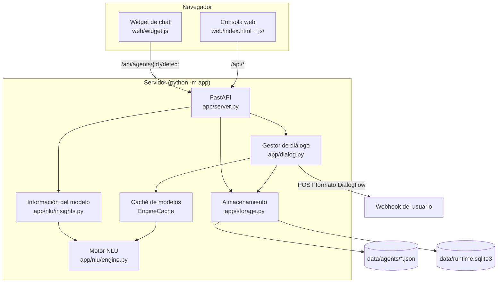

# Arquitectura y guía para desarrolladores

Todo lo necesario para entender el código de **Lince** y seguir desarrollándolo: cómo está
organizado, cómo funciona cada pieza, qué formato tienen los datos y por qué se tomó cada decisión.
Para *usar* la aplicación, mejor la [guía de uso](docs/GUIA.md).

> GitHub muestra este fichero en la pestaña **Contributing** de la portada del repositorio (solo
> admite pestañas con nombres fijos: README, LICENSE, CONTRIBUTING, CODE_OF_CONDUCT y SECURITY).

## Cómo desarrollar

1. Prepara el entorno:

   ```bash
   python -m venv .venv
   .venv\Scripts\activate          # Linux/macOS: source .venv/bin/activate
   pip install -r requirements-dev.txt
   ```

2. Arranca la consola con `python -m app` (<http://localhost:8000>). Tras cambiar código Python
   reinicia el servidor; para los cambios en `web/` basta con recargar el navegador. Si se te
   olvida, la consola lo avisa: `/api/info` devuelve `restartNeeded` cuando algún `.py` de `app/`
   es más nuevo que el arranque, y la consola compara su `APP_VERSION` (`web/js/app.js`) con la
   del servidor (`app/__init__.py`; al subir la versión cambia las dos, hay una prueba que lo
   comprueba). `python -m app` tampoco arranca encima de otro Lince: si el puerto está ocupado,
   lo explica.
3. Antes de subir cambios, pasa las pruebas (detalles en [Pruebas](#pruebas)):
   - `python -m pytest`: deben pasar todas.
   - Si tocas la consola: `pip install playwright` y `python -m pytest tests/e2e -m e2e`.
   - Si tocas el clasificador: `python tools/benchmark_massive.py` y compara con 59 % (10 frases
     por intención) y 65,6 % (20 frases).
   - Si cambias un agente de ejemplo, edita su generador (`tools/build_pizzeria.py`,
     `tools/build_hotel.py`) y ejecútalo: el JSON de `examples/` no se toca a mano (una prueba
     comprueba que `examples/hotel.json` es lo que genera su script).
4. Convenciones:
   - identificadores en inglés; comentarios, textos de la interfaz y documentación en español;
   - sin dependencias pesadas (ni scikit-learn ni frameworks de JavaScript);
   - todo agente pasa por `normalize_agent()`; en la web el DOM se crea con `h()`, nunca con
     `innerHTML` a partir de datos del usuario;
   - commits en español que expliquen el cambio y el motivo.

## Visión general



- **Sin dependencias pesadas**: FastAPI, uvicorn, numpy, snowballstemmer (solo para inglés) y tzdata.
  El NLU es propio; no usa scikit-learn ni modelos descargables.
- **Sin paso de compilación** en la web: módulos ES nativos servidos tal cual.
- **Un modelo por agente**, entrenado en memoria y reentrenado de forma perezosa cuando cambia la
  versión del agente.

## Estructura de carpetas

| Ruta | Responsabilidad |
|---|---|
| `app/__main__.py` | Arranque: argumentos `--host --port --data --no-browser`, abre el navegador |
| `app/server.py` | `create_app(data_dir)`: todas las rutas (con resumen en español para el OpenAPI), autenticación, ficheros estáticos (`/` = `web/`, `/guia` = `docs/`, `/docs` = `web/api.html`) |
| `app/storage.py` | Agentes en JSON (escritura atómica, versión incremental) y SQLite (logs y sesiones) |
| `app/agents.py` | `normalize_agent()` y compañía: todo lo que entra se limpia y completa aquí |
| `app/dialog.py` | `DialogManager.detect()`: un turno de conversación; `EngineCache` |
| `app/responses.py` | Formateo de valores y sustitución de `$param`, `#ctx.param` |
| `app/webhook.py` | Petición y respuesta del webhook en formato Dialogflow ES v2 |
| `app/importer.py` | Importar JSON propio o ZIP de Dialogflow ES |
| `app/validation.py` | Avisos de calidad (frases duplicadas, contextos huérfanos…) |
| `app/nlu/text.py` | `Tokenizer`, `Token`, normalización |
| `app/nlu/lang_es.py`, `lang_en.py` | Vocabulario por idioma (números, meses, abreviaturas, palabras de cancelar) |
| `app/nlu/languages.py` | Registro de idiomas y stemmers |
| `app/nlu/stemmer_es.py` | Stemmer Snowball español sobre texto sin tildes |
| `app/nlu/spelling.py` | Corrector SymSpell y distancia Damerau-Levenshtein |
| `app/nlu/sys_entities.py` | Entidades `@sys.*` (números, fechas, horas, duraciones, dinero…) |
| `app/nlu/entities.py` | Entidades propias (exacta, raíz, corregida, regex) |
| `app/nlu/common.py` | `EntityMatch` y resolución de solapamientos |
| `app/nlu/features.py` | Frase → rasgos (`w:`, `b:`, `e:`, `c:`, `p:`) |
| `app/nlu/classifier.py` | `Vectorizer` (TF-IDF por clases) e `IntentClassifier` (regresión logística SGD + similitud) |
| `app/nlu/engine.py` | `NLUEngine`: entrenamiento, `analyze()`, plantillas, parámetros, auto-anotación, informe |
| `app/nlu/insights.py` | Rasgos por intención, mapa t-SNE, explicación de una frase, validación cruzada |
| `web/js/app.js` | Estado global, rutas por `#hash`, barra lateral (selector de agente, navegación), títulos de pestaña |
| `web/js/ui.js` | `h()` (crea DOM sin `innerHTML`), iconos y logotipo, tema, modales, avisos, tooltips, chips, popovers y los componentes comunes (ver [Consola web](#consola-web)) |
| `web/js/palette.js` | Buscador / paleta de comandos (Ctrl+K) |
| `web/api.html`, `web/js/apidocs.js`, `web/css/api.css` | Referencia de la API (`/docs`): lee `/openapi.json` y pinta cada ruta con un formulario «Pruébalo» |
| `web/css/app.css` | Colores (claro y oscuro), fuente, componentes y animaciones; lo usan la consola y `/docs` |
| `web/favicon.svg`, `web/icons/`, `web/favicon.ico`, `web/manifest.webmanifest` | Logotipo, iconos y manifiesto para instalar la consola como aplicación |
| `web/fonts/` | Inter (OFL), solo el alfabeto latino: la consola no depende de internet |
| `web/js/annotate.js` | Frase anotable: seleccionar texto → elegir entidad |
| `web/js/charts.js` | Gráficos SVG/HTML: línea, barras, barras divergentes, columnas, puntos, matriz, medidor |
| `web/js/math.js` | Fórmulas: un subconjunto de TeX traducido a MathML (lo dibuja el navegador, sin librerías) |
| `web/js/markdown.js` | Intérprete mínimo de Markdown (para la guía y las descripciones de la API) |
| `web/js/simulator.js` | Panel «Pruébalo» |
| `web/js/pages/*.js` | Una página por sección de la consola (`inside.js` es «Por dentro»: el motor explicado con fórmulas) |
| `web/widget.js`, `web/chat.html` | Widget incrustable (Shadow DOM, sin dependencias; tema claro, oscuro o automático con `data-theme`, colores en variables CSS) y página de chat de demostración (`?theme=`, `?title=`, `?color=`, `?key=`) |
| `examples/pizzeria.json`, `examples/hotel.json` | Agentes de ejemplo: la pizzería (pequeña, para aprender) y el hotel (88 intenciones, para ver el potencial). `seed_examples()` (`server.py`) copia cada uno la primera vez que arranca el servidor con él y lo apunta en `data/seeded_examples.json`: un ejemplo borrado no vuelve. Las copias llevan `"example": true` y la consola las enseña aparte (grupo «Ejemplos», debajo de «Tus agentes», también en el menú de agentes) |
| `tools/build_pizzeria.py`, `tools/build_hotel.py` | Generan los ejemplos a partir de frases con la notación `[texto](parámetro)`. El del hotel además comprueba que cada anotación coincide con lo que detecta el motor (y que no queda nada sin anotar), que no hay frases repetidas y que la normalización no inventa parámetros |
| `tools/build_icons.py` | Genera `favicon.ico` y los PNG de `web/icons/` a partir de `web/favicon.svg` (Playwright con Edge, Chrome o Chromium) |
| `tools/capturas_docs.py` | Rehace las capturas de `docs/img/` con la consola actual (Playwright) |

## Formato de un agente

Fichero `data/agents/<id>.json` (ver `examples/pizzeria.json`). Todo pasa por
`app/agents.py:normalize_agent()` antes de guardarse.

```json
{
  "id": "pizzeria",
  "name": "Pizzería (ejemplo)",
  "language": "es",
  "timezone": "Europe/Madrid",
  "settings": {
    "threshold": 0.3, "defaultLifespan": 5, "spellCorrection": true,
    "normalization": {"pizzeta": "pizza"},
    "webhook": {"url": "", "headers": {}, "timeout": 5},
    "apiKey": ""
  },
  "entities": [
    {"id": "e001", "name": "tamano", "kind": "map", "fuzzy": true, "autoExpand": false,
     "entries": [{"value": "familiar", "synonyms": ["familiar", "grande", "XL"]}]}
  ],
  "intents": [
    {
      "id": "i019", "name": "pedido.pizza", "isFallback": false,
      "events": [], "inputContexts": [],
      "outputContexts": [{"name": "pedido", "lifespan": 5}],
      "resetContexts": false, "action": "pedido.crear",
      "parameters": [{"id": "a1", "name": "tamano", "entity": "@tamano", "required": true,
                      "isList": false, "prompts": ["¿De qué tamaño?"], "defaultValue": ""}],
      "trainingPhrases": [{"id": "p1", "text": "una margarita familiar",
                           "annotations": [{"start": 4, "end": 13, "entity": "@pizza", "param": "pizza"}]}],
      "responses": [{"type": "text", "variants": ["Marchando $pizza ($tamano)"]},
                    {"type": "quickReplies", "items": ["A domicilio", "Para recoger"]}],
      "webhook": false, "endConversation": false
    }
  ],
  "version": 7, "updatedAt": 1790844802.6
}
```

- `kind` de entidad: `map` (valor + sinónimos), `list` (solo valores), `regex`.
- `annotations: null` en una frase significa «anotar automáticamente al entrenar».
- Anotar una entidad crea el parámetro si no existe (`normalize_intent`).
- `version` sube en cada guardado; la caché de modelos la usa para saber cuándo reentrenar.
- `example: true` solo aparece en las copias de los ejemplos que hace `seed_examples()` (las de antes
  de la marca la reciben al arrancar si conservan el nombre del ejemplo y su id, o el que se les dio
  si ese estaba ocupado). Crear desde una
  plantilla, duplicar, exportar o importar la quitan: lo que sale de ahí es un agente propio.

SQLite (`data/runtime.sqlite3`):

- `logs`: un registro por turno (texto, intención, confianza, parámetros, respuesta, análisis
  compacto y estado de revisión `pending|approved|corrected|ignored|none`). Los turnos de slot
  filling, cancelación y eventos se guardan con `none` (no son frases útiles para entrenar).
- `sessions`: estado de cada conversación (contextos, parámetro pendiente). Caduca a los 20 min.

## El motor de lenguaje (NLU)

### Tokenización y normalización (`text.py`)

Una expresión regular reconoce, por orden: URL, email, hora `17:30`, fecha `15/03/2026`, número
`1.000,5`, palabra y símbolo. Cada `Token` guarda el texto original y su posición (para resaltar),
la forma normalizada (`casefold`, sin tildes, ñ→n, «holaaaa»→«hola», risas→«jaja»), la raíz y una
posible corrección. Las abreviaturas de chat (`lang_es.ABBREVIATIONS`) y las reglas del agente
(`settings.normalization`) pueden expandir un token en varios («xfa» → «por», «favor»), todos con
la misma posición.

### Raíces (`stemmer_es.py`)

Algoritmo Snowball español adaptado a texto **sin tildes**: así «cancelación» y «cancelacion» dan
la misma raíz. Ajustes propios: los plurales en `-des`, `-ares`, `-eres`, `-ires` se reducen antes
(ciudades → ciudad → «ciud», familiares → familiar → «famil»), y `-io/-ios` se tratan igual.

### Corrección ortográfica (`spelling.py`)

SymSpell con índice de borrados. Distancia máxima 1 (2 en palabras de 9+ letras). Solo corrige
palabras de 4+ letras que no están en el vocabulario (frases de entrenamiento, sinónimos y palabras
de fechas/números). **No cambia la primera letra** salvo la «h» muda («abla» → «habla»): sin esta
regla «apaga» se corregía a «paga».

### Entidades del sistema (`sys_entities.py`)

Analizadores escritos a mano sobre los tokens normalizados: números en cifra y en palabras
(«doscientos treinta y cinco»), ordinales, porcentajes, dinero, duraciones, fechas relativas y
absolutas (hoy, pasado mañana, el lunes que viene, el 15 de marzo, dentro de 3 días, el finde,
Navidad), horas («las 5 y cuarto de la tarde», «a la una menos cuarto», «21h»), fecha+hora, email,
URL y teléfono. Decisiones:

- «a las N» sin calificador: 1-7 → tarde (17:00), 8-12 tal cual. Salvo que la frase hable de la
  mañana (`MORNING_CUES`: despert-, levant-, madrug-, desayun-…: «despiértame a las 7» = 07:00) o
  de la noche (`EVENING_CUES`: cenar, noche…: «mesa para cenar a las 9» = 21:00).
- «esta mañana/tarde/noche» es hoy.
- Días sin mes: en rangos («del 12 al 15», «del 30 al 2 de noviembre», «el 12 de octubre al 15»;
  el mes que falta se toma del otro extremo y, si no cuadra, del mes anterior o siguiente) o con
  una palabra de llegada/salida delante (`_DAY_CUES`: «para el 12», «llegamos el 12», «nos vamos
  el 15»). «tengo 12 años», «la habitación 12» o «quiero el 2» no son fechas.
- «un/una» son números **débiles**: solo rellenan un parámetro `@sys.number` si detrás llevan lo
  que ese parámetro solía llevar detrás en las anotaciones («una noche» rellena las noches; «una
  habitación», no).
- «las dos pizzas» no es una hora: si tras «las N» viene una palabra que no es de hora/fecha, se descarta.

### Entidades propias (`entities.py`)

Índice de secuencias de tokens. Para cada posición se busca la secuencia más larga que coincida, por
orden: forma exacta (confianza 1), raíz en palabras de 4+ letras (plurales y género, 0,95), forma
corregida (solo si la entidad tolera faltas, 0,85) y expresiones regulares. `resolve_overlaps()`
elige un conjunto sin solapamientos: primero lo más largo; a igual longitud, entidades propias
exactas antes que las del sistema y los números al final.

### Rasgos (`features.py`)

Las entidades elegidas se sustituyen por su tipo y la frase se convierte en rasgos con peso:

| Rasgo | Ejemplo | Peso |
|---|---|---|
| `w:` raíz de palabra | `w:reserv` | 1 (0,5 si está dentro de una entidad) |
| `b:` pareja de unidades seguidas | `b:quier_reserv`, `b:para_@sys.number` | 1 |
| `e:` entidad | `e:@sys.date` | 1 |
| `c:` trozo de 3-4 letras con bordes | `c:<re`, `c:serv`, `c:ar>` | 1 |
| `p:` signo de pregunta | `p:?` | 1 |

Los números sin entidad se representan como `#num`. Si una palabra se corrigió, se usa la forma
corregida.

Excepción al entrenar: el **texto libre** (`@sys.any`, `@sys.person`… los tipos `ANY_LIKE`) no se
sustituye y cuenta como palabras normales. Al analizar un mensaje nunca se detecta como entidad, así
que sustituirlo solo creaba un rasgo `e:@sys.any` que no aparece al preguntar y dejaba a la mitad
las palabras de dentro: en el hotel, «[la persiana](averia) está rota» casi no enseñaba
«persiana». Solo con este cambio, «la persiana no sube» pasó de 0,00 a 0,25 de confianza y «la caja
fuerte no abre», de 0,05 a 0,63 (con unas cuantas frases de averías más, 0,84 y 0,89).

### Vectorización (`classifier.py: Vectorizer`)

TF-IDF con **IDF por intención** (no por frase): `idf = ln((1 + K) / (1 + nº de intenciones que
usan el rasgo)) + 1`, con `K` intenciones. Así una palabra frecuente dentro de una sola intención
sigue pesando mucho. TF sublineal (`1 + ln tf`). El bloque de palabras/parejas/entidades y el de
trozos de letras se normalizan por separado (L2) y se combinan con pesos √0,55 y √0,45: el coseno
entre dos frases es `0,55·cos(palabras) + 0,45·cos(letras)`.

### Clasificador (`classifier.py: IntentClassifier`)

1. **Regresión logística multiclase (softmax)** entrenada con SGD: 15 épocas, tasa 0,5 con
   decaimiento `0,5 / (1 + 0,02·época)`, regularización L2 1e-4, orden aleatorio con semilla fija
   (resultados reproducibles). Las frases del fallback forman la clase `__fallback__:<id>`. Se guarda
   la curva de aprendizaje (error y acierto tras cada época sobre una muestra de hasta 400 frases).
2. **Similitud**: índice invertido sobre los vectores de entrenamiento; para cada intención,
   `sim = max(0,7·top1 + 0,3·top2, coseno con el centroide)`.
3. **Probabilidad mezclada**: `0,85·p_logística + 0,15·softmax(sim / 0,1)`. Con pocas frases el
   vecino más parecido es una pista muy fiable.

### Decisión (`engine.py: NLUEngine.analyze`)

- Solo compiten las intenciones cuyos contextos de entrada están todos activos.
- La intención se **elige** por probabilidad mezclada (lo más preciso: +3 puntos en MASSIVE frente a
  ordenar por confianza).
- La **confianza** es `√p · min(1, sim / 0,65)²`, calibrada con `tests/casos_pizzeria.py` para usarse
  con umbral 0,3. Sin el factor de parecido, una frase fuera de tema puede salir con mucha
  probabilidad cuando hay pocas intenciones.
- Las intenciones con contexto de entrada reciben `conf·1,15 + 0,05` y, si su confianza es ≥ 0,5,
  ganan a las demás (como en Dialogflow).
- **Plantillas**: cada frase de entrenamiento se guarda como secuencia de raíces y entidades; si el
  mensaje coincide exactamente (las `@sys.any` son comodines), la confianza es 1,0 y los parámetros
  salen de la plantilla. Una frase igual gana a un comodín. Y un comodín no se impone a los
  ejemplos negativos: si el modelo ve el fallback más probable que esa intención, decide el modelo
  (como en Dialogflow). Así «[la nevera](averia) hace un ruido raro» sigue siendo una avería, pero
  «mi coche hace un ruido raro» no.
- `report.example`, la frase que usa la página Entrenar para ilustrar los pasos, es una de unas seis
  palabras con entidades; mejor si tiene dos y alguna propia del agente («¿tenéis una doble libre
  esta noche?»).

### Parámetros (`engine.py: extract_parameters`)

Por orden: valores de la plantilla exacta; candidatos del tipo de entidad que no estén dentro de otra
entidad elegida; si varios parámetros comparten tipo («de @ciudad a @ciudad», «para 3 noches para 2
personas»), se reparten por lo que cada uno solía llevar **a los lados** en las anotaciones: la
palabra (su raíz) o la entidad anterior y la siguiente, contadas y divididas por las veces que se
anotó el parámetro (`left_context`, `right_context`, `param_count`); `@sys.any` sin plantilla se
captura entre las anclas izquierda/derecha aprendidas («me llamo [X]» → hasta el final; «quiero [X]
para el sábado» → solo si aparece «para»).

El texto libre que llega hasta el final, de una plantilla o de un ancla, se recorta:

- antes de otro dato de la misma intención y sin palabras vacías colgando: «no se enciende la tele
  de la 215» → avería «la tele», habitación 215 (`_free_text_end`);
- sin muletillas delante (`LEADING_FILLERS`: oye, hola, mira, perdona…): «oye, la luz del baño no
  funciona» → «la luz del baño».

## Diálogo (`dialog.py`)

Un turno (`DialogManager.detect`):

1. Carga la sesión (o crea una nueva si caducó o terminó) y añade los contextos que mande el cliente.
2. Si había un **parámetro pendiente**: «cancelar» (solo si todo el mensaje son palabras de cancelar
   y de relleno) lo abandona; si el mensaje trae el valor, lo rellena (y otros que vengan); si no lo
   trae y otra intención supera 0,8, cambia de tema; si no, vuelve a preguntar. Si lo pendiente es
   texto libre y el mensaje lo trae entre sus anclas («estoy en la 304, no va la tele»), se usa lo
   extraído en vez del mensaje entero.
3. Si no: evento → intención con ese evento; texto → `analyze` y umbral → intención o fallback (el
   fallback más específico para los contextos activos).
4. Valores por defecto (`#contexto.param`, `$otro`, literal), y si falta un obligatorio se pregunta
   uno de sus `prompts`.
5. Si está completa: contextos de salida (con los parámetros y `param.original`), respuesta
   (variante al azar, sin repetir la que dio la última vez esa intención en la sesión:
   `state["said"]`; así «otro chiste» cuenta otro), webhook si está activado y `endConversation`.
6. **Duración de los contextos**: al final del turno los contextos previos pierden 1 turno; los
   puestos en este turno conservan su duración completa; 0 = borrar; `resetContexts` borra los previos.
7. Guarda la sesión y el registro, y devuelve el resultado (con el análisis completo si `debug`).

El **webhook** recibe `queryResult` (texto, acción, parámetros, contextos con nombre completo
`projects/<agente>/agent/sessions/<sesión>/contexts/<nombre>`, intención, confianza) y puede devolver
`fulfillmentText`, `fulfillmentMessages` (text, quickReplies, payload, card), `outputContexts`,
`payload` o `followupEventInput` (lanza otra intención por evento; máximo 3 encadenados). Si falla,
se usa la respuesta estática.

## API

Referencia completa en `/docs` y esquema en `/openapi.json`. `/docs` es una página propia
(`web/api.html` + `js/apidocs.js`) que lee el esquema y lo pinta con los componentes de la consola;
Swagger UI y ReDoc están desactivados porque se cargan de un CDN (no funcionan sin conexión) y no se
pueden adaptar al estilo. Para que la referencia salga bien:

- cada ruta lleva `summary=` en español y un docstring (la descripción, admite `código` y **negrita**);
- los grupos (`tags`) tienen descripción y orden en `TAGS` (`server.py`);
- los modelos y los `Body(...)` llevan ejemplos (`json_schema_extra` / `examples`), que son el cuerpo
  que propone el formulario «Pruébalo»;
- la seguridad se declara con `HTTPBearer` (`tokenAdmin`) y `APIKeyHeader` (`claveApi`) solo para el
  esquema: la comprobación real sigue en `admin()` y `check_key()`.

Resumen:

| Método y ruta | Uso |
|---|---|
| `GET /api/info` | Versión, idiomas, entidades del sistema, si hace falta token y si hay que reiniciar (`restartNeeded`) |
| `GET/POST /api/agents`, `POST /api/agents/import` | Listar, crear, importar (JSON o ZIP de Dialogflow) |
| `GET/PATCH/DELETE /api/agents/{id}` | Leer, cambiar ajustes, borrar |
| `GET /api/agents/{id}/export`, `POST .../duplicate` | Exportar JSON, duplicar |
| `POST/PUT/DELETE /api/agents/{id}/intents[/{iid}]` | Intenciones (`.../phrases` añade una frase) |
| `POST/PUT/DELETE /api/agents/{id}/entities[/{eid}]` | Entidades (`.../synonyms` añade un sinónimo) |
| `POST /api/agents/{id}/annotate` | Anotación automática de una frase |
| `POST /api/agents/{id}/analyze` | Análisis sin sesión (tokens, entidades, ranking, parámetros) |
| `POST /api/agents/{id}/detect` | **Conversación** (`sessionId`, `text` o `event`, `contexts`, `debug`) |
| `POST /api/agents/{id}/sessions/{sid}/reset` | Empezar de cero |
| `POST /api/agents/{id}/train`, `GET .../status` | Reentrenar (devuelve el informe), estado |
| `GET /api/agents/{id}/model` | Informe, rasgos por intención, mapa de frases, último examen |
| `POST /api/agents/{id}/explain` | Recorrido completo de una frase |
| `POST /api/agents/{id}/evaluate` | Examen con validación cruzada (`folds`) |
| `GET /api/agents/{id}/validate` | Avisos de calidad |
| `GET /api/agents/{id}/logs`, `POST .../logs/{lid}/review` | Revisión: listar y aprobar/asignar/ignorar |
| `GET /api/agents/{id}/conversations[/{sid}]`, `GET .../stats` | Historial y estadísticas (`daily`: mensajes por día local, según `tz`) |
| `POST /v2/projects/{id}/agent/sessions/{sid}:detectIntent` | Compatible con Dialogflow ES |

Seguridad: si existe `AGENTE_ADMIN_TOKEN`, las rutas de administración (agentes, intenciones,
entidades, entrenamiento, revisión, historial) exigen `Authorization: Bearer <token>`. Las de
conversación (`detect`, `sessions/.../reset`, `public`, `:detectIntent`) y `/api/info` no; si el
agente tiene `apiKey`, esas rutas de conversación exigen la cabecera `X-Api-Key`.

## Información del modelo (`insights.py`)

- `top_features`: columnas de la matriz de pesos ordenadas; los rasgos se traducen a texto legible
  (la raíz se muestra con su palabra más frecuente gracias a `engine.stem_words`).
- `projection`: **t-SNE** (implementación compacta en numpy, perplejidad 20, 400 iteraciones,
  semilla fija) sobre las **puntuaciones del modelo** de cada frase, seguido de una **repulsión de
  corto alcance** que separa los puntos superpuestos. Se probaron alternativas (silueta de los grupos
  en el ejemplo): PCA sobre TF-IDF −0,21, PCA sobre puntuaciones 0,03, t-SNE sobre TF-IDF 0,04,
  t-SNE sobre puntuaciones 0,87 (pero con el 92 % de puntos superpuestos) y con repulsión 0,75 sin
  superposición. Hasta 700 frases (muestra estratificada). Una frase nueva se coloca en la media
  ponderada de sus 5 vecinos más cercanos en el espacio de puntuaciones. Las distancias se calculan
  con la matriz de Gram (`|a−b|² = |a|² + |b|² − 2a·b`, sin tablas n×n×intenciones, que con 700
  frases y 90 intenciones ocupaban 350 MB), el descenso va en float32 y la perplejidad se calibra
  para todas las filas a la vez: con 700 frases tarda unos 2 s en vez de 18, con el mismo mapa.
- `explain`: tokens, entidades, rasgos con TF-IDF, ranking y, para las 3 primeras intenciones, la
  aportación de cada rasgo (`peso TF-IDF × peso aprendido`) más el sesgo.
- `evaluate`: validación cruzada estratificada (5 rondas por defecto), entrenando un `NLUEngine`
  completo por ronda y evaluando cada frase con los contextos de entrada de su intención activos.
  Con frases muy variadas es pesimista: una frase escondida que era la única de su estilo se queda
  por debajo del umbral aunque elija bien la intención. El hotel saca un 65 % (527 de sus 820
  fallos son «no entendida») y, en cambio, acierta el 91,5 % de frases nuevas escritas aparte.
  Tarda unos 20 s con las 2.300 frases del hotel.

## Consola web

- `h(tag, props, ...children)` construye el DOM; el texto siempre como nodos de texto (nunca
  `innerHTML` con datos de usuario). Los únicos `innerHTML` son iconos SVG constantes.
- Rutas por hash (`#/a/<agente>/<sección>[/<id>]`, con `?q=` opcional). Cada página exporta
  `render(el, params, query)` y puede devolver `{canLeave, save, destroy}` (aviso de cambios sin
  guardar y Ctrl+S).
- La raíz (`#/` o sin hash) abre la lista de agentes.
- Cada página se dibuja en su propio contenedor dentro de `#page`: si el usuario cambia de página
  antes de que termine de cargar, lo que llegue tarde no se mezcla con la nueva. Si tarda más de
  150 ms se ve un esqueleto de carga, siempre que la página no añada nada hasta tener sus datos
  (Entrenar espera a `/model` antes de añadir su contenedor).
- Con agentes grandes, Entrenar enseña en «Lo que ha aprendido» las 12 intenciones con más frases
  (con buscador y «Ver todas»), y las tablas del examen tienen scroll propio. El atributo `hidden`
  lleva `display: none !important` en `app.css`: si no, `.row` o `.btn` lo pisan.
- `/docs` pone la pizzería la primera en «Pruébalo», porque los ejemplos de la API están escritos
  para ella.
- El estado del agente vive en `state.agent`; tras cambiar algo en el servidor desde otra pantalla
  (revisión, 👍/👎) se recarga con `reloadAgent()`.
- Tema: variables CSS en `:root` y en `[data-theme=dark]` / `prefers-color-scheme`. El modo oscuro
  usa grises neutros; el acento es índigo (`--primary`) y el logotipo usa `--brand-1`/`--brand-2`.
  Contrastes comprobados (texto ≥ 15:1, secundario ≥ 5,5:1, botones primarios ≥ 4,8:1). El cambio
  de tema se anima con View Transitions (un círculo desde el botón) y se guarda en `agente.theme`.
- Bloques de código: siguen el tema (claros en el claro, oscuros en el oscuro) con `--code-*` y los
  colores de sintaxis `--tok-*`, todos con contraste ≥ 4,5:1 sobre su fondo.
- Los colores de los gráficos (`--series-1` azul, `--series-2` naranja, `--series-neg` rojo,
  `--deemph` gris) se validaron para daltonismo y contraste en ambos modos: no cambiarlos sin
  revalidar.
- Fuente: Inter variable incluida (`web/fonts/`, solo latín, ~70 KB), con las del sistema de reserva.
- Componentes de `ui.js` (úsalos antes de crear otros): `pageHead()` (cabecera con icono, migas y
  acciones; `sticky` en los editores; si no caben, las acciones bajan a otra línea en vez de
  estrujar el título), `optionList()` (lista filtrable para los menús; con `sub` cada opción ocupa
  dos líneas), `dataTable()` (tabla con columnas ordenables y animación al
  reordenar), `segmented()` (pestañas con indicador que se desliza), `codeBlock()` / `codeTabs()`
  (código con botón Copiar; `json: true` lo colorea), `emptyState()`, `busy(botón, fn)` (estado
  «cargando»), `countUp()` (cifras que cuentan), `stagger()` (los elementos aparecen en cascada),
  `avatar()`, `logo()`, `copyButton()`, `toggleTheme()`.
- Los `title` se muestran como tooltips propios (`initTooltips()`): basta con poner `title` a un
  botón o marca.
- Microanimaciones: en CSS (`@keyframes` al principio de `app.css`), cortas (150-400 ms) y con
  `prefers-reduced-motion` desactivándolas todas. Las ventanas y avisos tienen animación de salida:
  la caja que se va deja de llamarse `.modal` para no confundirse con la siguiente.
- Gráficos (`charts.js`): una sola escala por gráfico, marcas finas, tooltip al pasar el ratón,
  identidad nunca solo por color (leyendas y etiquetas).
- Matriz de confusión (`charts.js:heatmap`): con 24 intenciones o menos, tabla con números; con
  más, un SVG compacto que cabe en el ancho (casillas sin número, intensidad con raíz cuadrada y
  máximos separados para la diagonal y las confusiones, separadores por prefijo de la intención y
  tooltip con el ratón o las flechas del teclado). Así el hotel (88) se ve sin scroll horizontal.
- Página «Por dentro» (`pages/inside.js`, ruta `#/inside` o `#/a/<agente>/inside`): una sección
  por paso del NLU con su fórmula, la leyenda de símbolos, una caja «Con tu frase» que se rellena
  con `/explain` y `/analyze` (el ranking trae `lr`, la probabilidad de la regresión antes de
  mezclarla con el parecido) y la referencia al código. Los gráficos se dibujan a mano en SVG o
  HTML (la cascada es HTML para que se lea en el móvil). Si cambia una fórmula del motor, cambia
  también aquí.
- «Por dentro» en el móvil (container queries sobre `.cq`): con 560 px o menos el recorrido va en dos
  columnas y la cascada y las barras ponen la etiqueta encima (entera) y la barra debajo, a todo el
  ancho; con 440 o menos la tabla de parámetros se apila (`.cards-sm`, cada número con su columna
  delante por `data-label`), la tabla de distancias se compacta y la raíz va debajo de la palabra.
  Los gráficos SVG se estrechan con su `viewBox` y su texto encogería con ellos: `fitCharts()` pone
  `--text-k` (ancho del `viewBox` / ancho real, hasta 1,4) y el CSS multiplica por él los tamaños.
  Lo que aún no quepa (alguna fórmula a 320-360 px, la tabla de contextos a 320) se desplaza con una
  sombra en el borde por el que sigue (fondos `local` + `scroll`, color en `--scroll-bg`). La prueba
  e2e `test_por_dentro_en_el_movil` comprueba a 320 y 390 px que no hay nada fuera ni cortado.
- Fórmulas (`math.js`): `tex("p_k = \\frac{e^{z_k}}{\\sum_j e^{z_j}}", {display})` traduce un
  subconjunto de TeX a MathML Core, que pinta el propio navegador (sin KaTeX ni CDN); crea los
  nodos uno a uno, nunca `innerHTML`. Las llaves y raíces que se estiran necesitan una fuente
  matemática (Cambria Math en Windows; en Linux sin ella se ven bien pero sin estirar).
  `formula([a, b])` pone varias juntas y las baja de línea si no caben. Como en TeX, los paréntesis,
  corchetes y barras normales no se estiran (`stretchy="false"`: MathML los estiraría hasta lo más
  alto de su fila, y «d(i,j)» junto a una llave salía con paréntesis enormes); los de `\left…\right`
  sí, y van en su propio `mrow` para estirarse solo hasta lo que encierran. `fitFormulas(root)`
  encoge las que no caben a lo ancho (hasta el 75 %, en píxeles enteros y comprobando cada vez:
  el ancho no es proporcional a la letra porque el tamaño se redondea al dibujar) y marca con
  `.scrolls` las que ni así caben, que se alinean a la izquierda: centradas con `justify-content:
  center`, lo que sobra por la izquierda no se podría ver. «Por dentro» la vuelve a llamar al
  cambiar el ancho (ResizeObserver) y al redibujar «Con tu frase» (MutationObserver).
- Las tarjetas de una rejilla (`.grid-*`, `.agent-cards`) anulan el `margin-top` de `.card + .card`.
- Logotipo: la cabeza de un lince ibérico (orejas con pinceles negros, barba en las mejillas, ojos
  con brillo) sobre el degradado de la marca, en `web/favicon.svg`; el mismo dibujo está en
  `ui.js:logo()` (`tests/test_api.py` comprueba que coinciden). La mitad izquierda es el reflejo de
  la derecha: la cabeza y las orejas van en rutas separadas, porque al reflejarla la oreja izquierda
  gira al revés y en la misma ruta (regla `nonzero`) dejaría un agujero. Si cambia, regenera los
  iconos con `python tools/build_icons.py` y las capturas con `python tools/capturas_docs.py`.

## Pruebas

| Comando | Qué cubre |
|---|---|
| `python -m pytest` | 134 pruebas: tokenizador, stemmer, corrector, entidades (rangos de días, horas de mañana y de noche), clasificación (umbral y fuera de tema), parámetros del mismo tipo, contextos, diálogo completo, webhook real, API (incluido el esquema OpenAPI, los recursos de la web, la copia de los ejemplos al arrancar y su marca `example`), importación ZIP, información del modelo, versión de consola y servidor, logotipo igual en `favicon.svg` y `ui.js`, aviso de reinicio, arranque con el puerto ocupado y el agente del hotel (`tests/test_hotel.py`) |
| `python -m pytest tests/e2e -m e2e` | 27 pruebas con Playwright en un navegador real (Edge, Chrome o Chromium): todas las páginas sin errores, «Por dentro» en el móvil (320 y 390 px: nada fuera ni cortado), fórmulas como en TeX, la raíz abre la lista de agentes con los ejemplos aparte (también en el menú de agentes), editar y anotar, simulador, analizador, página Entrenar (también con el hotel: las 12 primeras, buscador y «Ver todas»), crear agente, tema oscuro, menú de agentes y cabeceras a 1280 px, widget oscuro, aviso de servidor desactualizado, buscador Ctrl+K y referencia de la API con «Pruébalo» |
| `python tools/capturas_docs.py` | No es una prueba, pero sirve para revisar la consola a ojo: rehace las capturas de `docs/img/` |
| `python tools/benchmark_massive.py` | Acierto con MASSIVE (60 intenciones): 59 % con 10 frases por intención, 65-66 % con 20 |

`tests/casos_pizzeria.py` contiene frases nunca vistas (paráfrasis, faltas, sin tildes), frases
con contexto y frases fuera de tema; los tests exigen ≥ 93 % de acierto y ≥ 80 % de rechazo.

`tests/casos_hotel.py` hace lo mismo para el hotel: 770 frases de 78 intenciones, 128 fuera de tema
y 10 con contexto, ninguna igual a una de entrenamiento (se comprobó sin tildes ni signos). Se
escribieron en seis rondas y los fallos de cada una se añadieron al agente, así que ahí acierta
casi todas (las pruebas exigen ≥ 97 % y ≥ 90 % de rechazo, al umbral del agente, 0,25). La medida
honesta es la de la última ronda antes de usarla: 118 de 129 frases nuevas (91,5 %) y 19 de 23
rechazadas. `tests/test_hotel.py` comprueba además conversaciones completas con la fecha fija
(reserva con confirmación, cambios, cancelación con código, avería, despertador, mesa para cenar,
respuestas sin repetir).

## Decisiones y alternativas descartadas

- **Regresión logística por SGD** frente a otras opciones (MASSIVE-es, 50 intenciones, 20 frases):
  regresión logística 69,7 %, centroide 65,0 %, perceptrón 63,4 %, kNN 62,1 %. El entrenamiento
  completo por lotes era más lento (38 s) y peor; SGD con numpy entrena en ~0,5 s.
- **IDF por intención** en lugar de por documento: mejor con pocas frases (+3 puntos en kNN).
- **Sin scikit-learn**: evita ~50 MB de dependencias y el código es más fácil de seguir para aprender.
- **Stemmer propio sin tildes** en vez de Snowball original: el original da raíces distintas con y
  sin tilde («cancelación» → «cancel», «cancelacion» → «cancelacion»).
- **JavaScript sin framework ni compilación**: cero herramientas para el usuario; se instala solo
  con Python.
- **Referencia de la API propia** en vez de Swagger UI: Swagger se descarga de un CDN (sin internet
  no funciona), está en inglés y no se puede adaptar al estilo de la consola. La propia reutiliza
  `ui.js` y `app.css` y añade lo que más se usa aquí: ejemplos en español y «Pruébalo» con los
  agentes reales.
- **Fuente incluida** (Inter, OFL) en vez de Google Fonts: la consola tiene que funcionar sin
  conexión y no debe hacer peticiones a terceros.
- **Agentes en JSON** (versionables, fáciles de copiar) y **SQLite** para lo que crece (conversaciones).
- **Medir con frases escritas aparte**, no solo con la validación cruzada: con frases tan variadas
  como las del hotel, la validación cruzada da un 65 % y frases nuevas de verdad, un 91,5 %. Al
  afinar con una ronda, esa ronda deja de servir para medir: hace falta otra nueva (y comprobar
  que ninguna frase está ya en el entrenamiento, que pasa más de lo que parece).
- **Umbral por agente**: el hotel usa 0,25. Bajar el exponente del parecido en la confianza era
  equivalente a bajar el umbral para todos los agentes, y la pizzería está calibrada a 0,3.
- **Descartado: dar prioridad al fallback sobre los comodines siempre que fuera la clase más
  probable**. Antes de que el texto libre contara como palabras al entrenar, averías de verdad
  como «la luz del baño no va» tenían el fallback arriba (0,65). Con ese arreglo la regla separa
  bien: en las averías de verdad el fallback no pasa de 0,05.

## Limitaciones conocidas

- Es un modelo léxico: no entiende sinónimos que no aparezcan en las frases o entidades («coche» y
  «automóvil» no se parecen salvo que se lo enseñes). Los *embeddings* serían la mejora natural.
- Algunas frases fuera de tema con palabras del dominio se aceptan («reservar un vuelo» en una
  pizzería) hasta que se añaden como ejemplos negativos.
- `@sys.given-name`, `@sys.geo-city` y similares no tienen diccionario: se aprenden por posición
  como `@sys.any`.
- El t-SNE es O(n²): por eso el mapa usa como mucho 700 frases (unos 2 s la primera vez; después
  queda en caché hasta el siguiente entrenamiento).
- Los comodines aceptan cualquier cosa en su hueco: «[X] pierde agua» también acepta «mi lavadora
  pierde agua» si el modelo no lo ve claro como fallback. Se corrige con ejemplos negativos.
