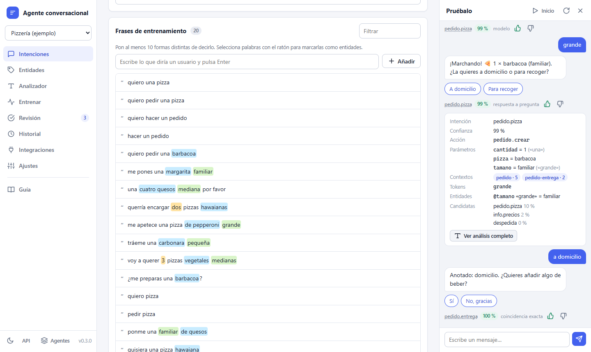
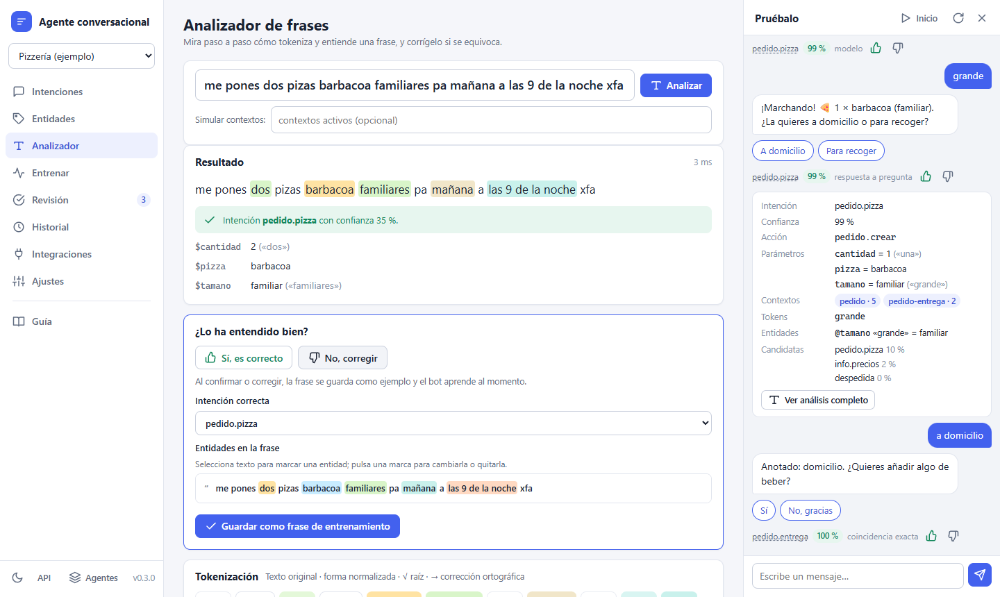
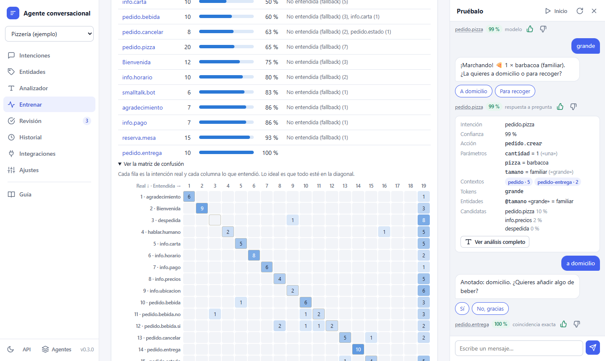
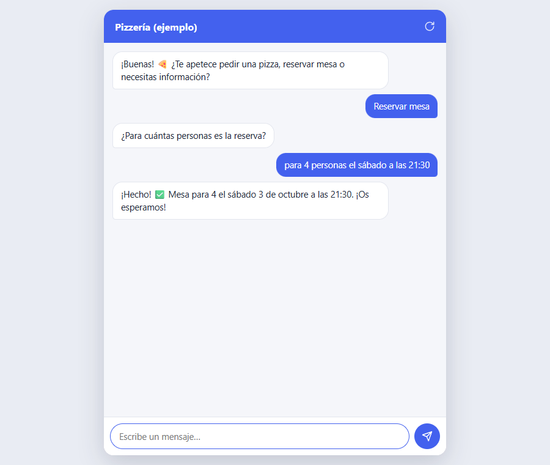
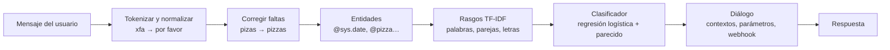

# Agente conversacional

**Alternativa libre a Dialogflow para crear chatbots en español**, que funciona en tu propio
ordenador o servidor: sin cuentas, sin límites y sin pagar por mensaje. Y pensada también para
**aprender** cómo funciona por dentro un sistema de comprensión del lenguaje.

Defines **intenciones** con frases de ejemplo, **entidades** con sinónimos, **contextos** para guiar
la conversación y **respuestas**. El bot entiende lo que escribe la gente (con faltas, sin tildes,
abreviaturas de chat…), te enseña **cómo ha tokenizado y entendido cada frase**, puedes
**corregirlo con un clic** y puedes **ver paso a paso cómo aprende** al entrenarlo.



## Índice

- [Qué incluye](#qué-incluye)
- [Instalación](#instalación)
- [Primeros pasos](#primeros-pasos)
- [Ver cómo aprende](#ver-cómo-aprende)
- [Conceptos](#conceptos)
- [Conectarlo a tu web o aplicación](#conectarlo-a-tu-web-o-aplicación)
- [Migrar desde Dialogflow](#migrar-desde-dialogflow)
- [Ponerlo en un servidor](#ponerlo-en-un-servidor)
- [Cómo funciona por dentro](#cómo-funciona-por-dentro)
- [Desarrollo](#desarrollo)
- [Hoja de ruta](#hoja-de-ruta)

Documentación completa: **[Guía de uso](docs/GUIA.md)** (también dentro de la aplicación, en
*Guía*) y **[Arquitectura](docs/ARQUITECTURA.md)** (detalles técnicos para desarrollar).

## Qué incluye

| | |
|---|---|
| **Intenciones** | Frases de entrenamiento, anotación de entidades seleccionando texto (como en Dialogflow), acción y parámetros, respuestas con variantes, respuestas rápidas y payload JSON, eventos (`WELCOME`), fallback con ejemplos negativos |
| **Entidades** | Propias con sinónimos, listas o expresiones regulares; toleran faltas y plurales; expansión automática. Del sistema: `@sys.number`, `@sys.date`, `@sys.time`, `@sys.date-time`, `@sys.duration`, `@sys.unit-currency`, `@sys.percentage`, `@sys.email`, `@sys.phone-number`, `@sys.url`, `@sys.ordinal`, `@sys.any`… |
| **Contextos** | De entrada y de salida con duración en turnos; preguntas de seguimiento («sí»/«no» solo cuentan tras una pregunta) |
| **Parámetros obligatorios** | Si falta un dato, el bot lo pregunta (slot filling) y entiende «cancelar» o un cambio de tema |
| **Analizador** | Tokens, forma normalizada, raíz, correcciones ortográficas, entidades, intenciones candidatas con su confianza y frases de entrenamiento más parecidas |
| **Entrenar** | Animación de los 6 pasos del entrenamiento, curva de aprendizaje, rasgos más importantes de cada intención, recorrido de una frase hasta la decisión, mapa de frases y examen con validación cruzada |
| **Aprendizaje continuo** | Botones 👍/👎 en el simulador y pantalla de **Revisión** con los mensajes reales para aprobar o corregir; añadir sinónimos y reglas de normalización |
| **Integraciones** | Widget de chat para cualquier web (una línea), API REST, API compatible con `detectIntent` de Dialogflow ES y webhook con el formato de Dialogflow |
| **Migración** | Importa agentes exportados de Dialogflow ES (ZIP) |
| **Consola** | Tema claro y oscuro, adaptable a móvil, guía de uso integrada |
| **Idiomas** | Español (completo) e inglés |

## Instalación

Necesitas **Python 3.11 o superior** ([descargar](https://www.python.org/downloads/); en Windows
marca «Add python.exe to PATH» al instalarlo). No hace falta nada más: ni Node, ni bases de datos,
ni claves de API.

**Windows:** descarga el proyecto (botón verde *Code → Download ZIP*, o `git clone`) y haz **doble
clic en `iniciar.bat`**. La primera vez prepara el entorno (un minuto) y después abre la consola en
el navegador: <http://localhost:8000>.

**Linux / macOS:**

```bash
git clone https://github.com/pablomise004/agenteconversacional.git
cd agenteconversacional
./iniciar.sh
```

**A mano** (cualquier sistema):

```bash
python -m venv .venv
.venv\Scripts\activate            # Linux/macOS: source .venv/bin/activate
pip install -r requirements.txt
python -m app                     # opciones: --port 8000 --host 0.0.0.0 --no-browser --data carpeta
```

Al arrancar por primera vez se crea el agente de ejemplo **Pizzería** (pedidos, reservas, carta,
horarios) para que puedas trastear desde el principio. Tus datos se guardan en la carpeta `data/`
(no se sube a Git).

## Primeros pasos

1. Abre <http://localhost:8000> y escribe en el panel **Pruébalo**: «hola», «quiero una pizza»,
   «barbacoa», «grande», «a domicilio»… Pulsa el nombre de la intención bajo cada respuesta para ver
   qué ha entendido.
2. Si se equivoca, pulsa 👎 y elige la intención correcta: la frase se añade al entrenamiento y el
   modelo se actualiza al instante.
3. En **Analizador** escribe cualquier frase para ver su tokenización completa y corregirla.
4. En **Entrenar** pulsa «Entrenar paso a paso» y mira cómo aprende.
5. Crea tu propio agente en *Agentes → Crear agente*: escribe frases de ejemplo (mejor 10 o más por
   intención), selecciona palabras con el ratón para marcarlas como entidades y añade respuestas.



## Ver cómo aprende

La página **Entrenar** está pensada para aprender *machine learning* con tu propio agente:

- **Qué hace al entrenar**: los seis pasos (reunir ejemplos, tokenizar, marcar entidades, convertir
  en rasgos con TF-IDF, aprender los pesos y preparar la memoria), con cifras reales y animados.
- **Curva de aprendizaje**: el error y los aciertos época a época.

  

- **Sigue una frase por dentro**: tokens → entidades → rasgos con su peso → probabilidad de cada
  intención → **por qué gana** (qué rasgos suman y cuáles restan) → decisión frente al umbral.

  

- **Lo que ha aprendido cada intención**: sus rasgos con más peso.
- **Mapa de frases**: cada frase de entrenamiento como un punto (t-SNE sobre las puntuaciones del
  modelo). Resalta dos intenciones para ver si están bien separadas.

  

- **Examen**: validación cruzada (esconde frases, entrena con el resto y mide el acierto real),
  matriz de confusión y lista de frases falladas.

  

La [guía](docs/GUIA.md#cómo-aprende-el-agente) lo explica en lenguaje sencillo.

## Conceptos

Son los mismos que en Dialogflow (explicados con detalle en la [guía](docs/GUIA.md#los-conceptos)):

| Concepto | Qué es |
|---|---|
| **Intención** | Lo que quiere el usuario («pedir una pizza»). Tiene frases de entrenamiento y respuestas |
| **Entidad** | Un tipo de dato dentro de la frase (`@pizza`, `@sys.date`), con valores y sinónimos |
| **Parámetro** | El valor extraído de una entidad (`$tamano = familiar`); si es obligatorio y falta, se pregunta |
| **Contexto** | Memoria de la conversación: una intención con contexto de entrada solo se activa después de otra |
| **Evento** | Activa una intención sin texto (`WELCOME` al abrir el chat) |
| **Fallback** | Lo que responde cuando no entiende; sus frases son ejemplos negativos |
| **Umbral** | Confianza mínima para aceptar una intención (por defecto 0,30) |

En las respuestas puedes usar `$parametro` (formateado: «viernes 2 de octubre», «21:30», «a, b y c»),
`$parametro.original` (lo que escribió el usuario), `$parametro.value` (valor en bruto) y
`#contexto.parametro`.

## Conectarlo a tu web o aplicación

**Widget de chat** — pega esto antes de `</body>` (la página *Integraciones* lo genera con tus
colores):

```html
<script src="http://localhost:8000/widget.js" data-agent="pizzeria" data-title="Pizzería"></script>
```

También hay una página de chat completa en `/chat?agent=pizzeria`.



**API REST:**

```bash
curl -X POST http://localhost:8000/api/agents/pizzeria/detect \
  -H "Content-Type: application/json" \
  -d '{"sessionId": "usuario-123", "text": "quiero una pizza barbacoa familiar"}'
```

Devuelve la intención, la confianza, los parámetros, los contextos y los mensajes de respuesta. La
documentación interactiva de toda la API está en <http://localhost:8000/docs>.

**Compatible con Dialogflow:** `POST /v2/projects/{agente}/agent/sessions/{sesión}:detectIntent`
acepta y devuelve el mismo JSON que la API v2 de Dialogflow ES.

**Webhook:** configura la URL en *Ajustes* y activa «Llamar al webhook» en las intenciones. Recibe la
misma petición que mandaría Dialogflow ES y puede responder con `fulfillmentText`,
`fulfillmentMessages`, `outputContexts` o `followupEventInput`: los webhooks escritos para Dialogflow
funcionan sin cambios.

## Migrar desde Dialogflow

En la consola de Dialogflow ES: *Configuración del agente → Exportar e importar → Exportar como ZIP*.
Aquí: *Agentes → Importar* y elige el ZIP. Se conservan intenciones, frases con anotaciones,
entidades, contextos, parámetros con sus preguntas, respuestas de texto y rápidas, eventos, umbral y
la URL del webhook.

## Ponerlo en un servidor

Con Docker:

```bash
docker build -t agente .
docker run -d -p 8000:8000 -v agente-datos:/data -e AGENTE_ADMIN_TOKEN=pon-aqui-un-secreto agente
```

O en cualquier máquina con Python: `python -m app --host 0.0.0.0 --port 8000 --no-browser`.

| Variable | Para qué |
|---|---|
| `AGENTE_ADMIN_TOKEN` | Protege la consola y la API de administración (se pide al entrar). Muy recomendable si el servidor es público |
| `AGENTE_DATA_DIR` | Carpeta de datos (por defecto `./data`) |
| `HOST` / `PORT` | Dirección y puerto |

Cada agente puede tener además una **clave de API** (*Ajustes → Seguridad*) que exige la cabecera
`X-Api-Key` para hablar con el bot.

## Cómo funciona por dentro

Todo el procesamiento del lenguaje es propio y local (sin servicios externos):



1. **Tokenización** con posiciones: minúsculas, sin tildes, «holaaaa» → «hola», abreviaturas de
   chat («xq», «xfa», «finde»…) y tus reglas de normalización.
2. **Corrección ortográfica** contra el vocabulario del agente (algoritmo SymSpell).
3. **Raíces** con un stemmer español (Snowball adaptado a texto sin tildes).
4. **Entidades** del sistema (fechas relativas, horas con «de la tarde» o «menos cuarto», números en
   palabras…) y propias (sinónimos, plurales, faltas, regex).
5. **Clasificación**: TF-IDF por intención (palabras, parejas de palabras, entidades y trozos de
   letras) → regresión logística entrenada con SGD, combinada con la similitud con las frases de
   entrenamiento. Una frase idéntica a una de entrenamiento da confianza 100 %.
6. **Diálogo**: filtra intenciones por contexto, rellena parámetros y genera la respuesta.

**Calidad**, medida con el dataset público MASSIVE (Amazon, 60 intenciones de asistente doméstico
en español, muchas muy parecidas entre sí): **65 % de acierto con 20 frases por intención** (59 % con
10), entrenando en un par de segundos. Con agentes normales, de intenciones más distintas, acierta
mucho más: con el de ejemplo, 74 de 76 frases de prueba nunca vistas (con faltas y sin tildes), y
rechaza 22 de 25 frases fuera de tema.

Más detalles (fórmulas, decisiones de diseño, formato de datos): [docs/ARQUITECTURA.md](docs/ARQUITECTURA.md).

## Desarrollo

```bash
pip install -r requirements-dev.txt
python -m pytest                            # 84 pruebas: NLU, diálogo, webhook, API, importación, modelo
pip install playwright
python -m pytest tests/e2e -m e2e           # 15 pruebas en navegador real (usa Edge o Chrome instalados)
python tools/benchmark_massive.py           # acierto con MASSIVE (descarga 260 KB la primera vez)
python tools/probar_nlu.py "quiero una pizza barbacoa familiar"
```

```
app/
  __main__.py      arranque (python -m app)
  server.py        API REST (FastAPI) y servidor de la consola
  dialog.py        gestor de diálogo: sesiones, contextos, slot filling, webhook
  storage.py       agentes en JSON y conversaciones en SQLite
  agents.py        validación y normalización de agentes
  responses.py     texto de las respuestas ($parametro, #contexto.param…)
  webhook.py       llamadas al webhook (formato Dialogflow ES)
  importer.py      importación de JSON y ZIP de Dialogflow
  validation.py    avisos de calidad del agente
  nlu/             motor de lenguaje: tokenizador, stemmer, entidades, clasificador, motor, insights
web/               consola (HTML/CSS/JS sin compilación), widget.js y chat.html
docs/              guía de uso, arquitectura e imágenes
examples/          agente de ejemplo (pizzería)
tests/             pruebas automáticas (tests/e2e: navegador)
tools/             benchmark, generador del ejemplo, prueba rápida del NLU
```

**Para seguir desarrollando con Claude Code** en otro equipo: clona el repositorio y abre Claude
Code en la carpeta. El fichero [CLAUDE.md](CLAUDE.md) se carga solo y contiene el contexto del
proyecto (decisiones, convenciones, cómo probar, ideas pendientes).

## Hoja de ruta

- Respuestas condicionales (según el valor de un parámetro) y por canal.
- Exportar a ZIP de Dialogflow ES (ahora solo se importa).
- Modo avanzado opcional con *embeddings* multilingües para acertar más con pocas frases.
- Entidades compuestas y diccionarios de ciudades/nombres.
- Más idiomas (francés, italiano, portugués…).

## Licencia

MIT
