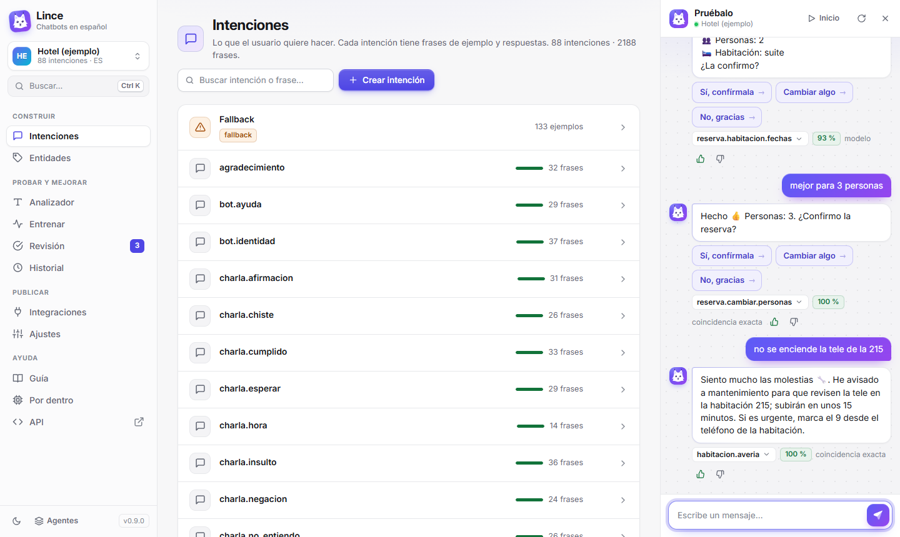
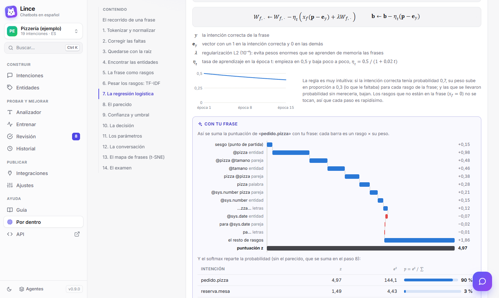
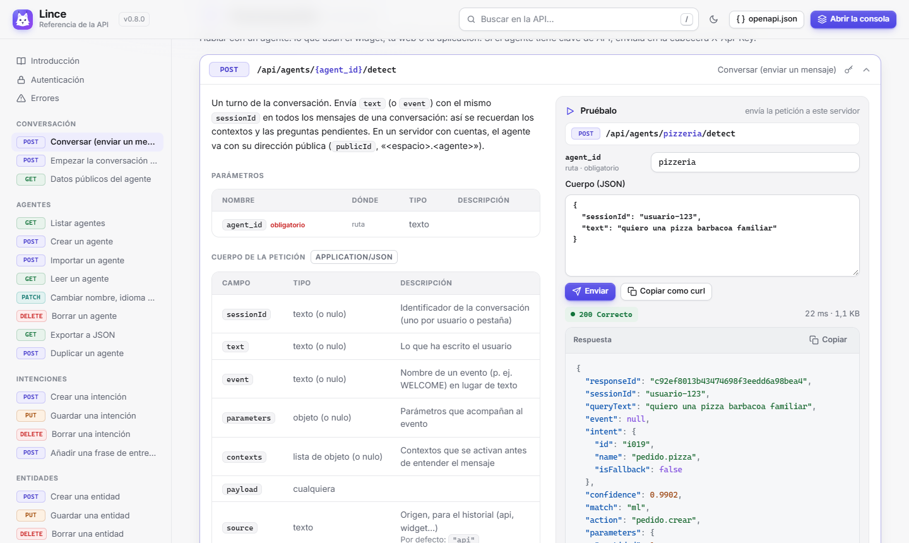
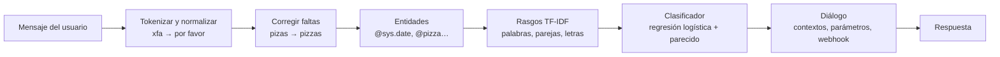

# Lince

**Chatbots en español, libres y en tu ordenador.** Lince es un agente conversacional, una
alternativa a Dialogflow que funciona en tu propio ordenador o servidor: sin cuentas, sin límites y
sin pagar por mensaje. Y está pensado también para **aprender** cómo funciona por dentro un sistema
de comprensión del lenguaje.

> ¿Por qué «Lince»? Porque entiende rápido (*listo como un lince*) y te deja ver por dentro cómo lo
> hace (*vista de lince*).

Defines **intenciones** con frases de ejemplo, **entidades** con sinónimos, **contextos** para guiar
la conversación y **respuestas**. El bot entiende lo que escribe la gente (con faltas, sin tildes,
abreviaturas de chat…), te enseña **cómo ha tokenizado y entendido cada frase**, puedes
**corregirlo con un clic** y puedes **ver paso a paso cómo aprende** al entrenarlo.

> **Pruébalo en internet:** <https://linceflow.duckdns.org>. Crea tu cuenta y tendrás tus propios
> agentes. **¿Estás en el instituto?** La red de Educacyl bloquea los dominios `duckdns.org`, así
> que seguramente no abrirá: instala Lince en tu ordenador siguiendo la
> [instalación en Windows, paso a paso](#instalación-en-windows-paso-a-paso). Son tres pasos y
> después funciona sin internet.


## Índice

- [Qué incluye](#qué-incluye)
- [Pruébalo en internet](#pruébalo-en-internet)
- [Instalación en Windows, paso a paso](#instalación-en-windows-paso-a-paso)
- [Linux, macOS o a mano](#linux-macos-o-a-mano)
- [Primeros pasos](#primeros-pasos)
- [Los agentes de ejemplo](#los-agentes-de-ejemplo)
- [Ver cómo aprende](#ver-cómo-aprende)
- [Conceptos](#conceptos)
- [Conectarlo a tu web o aplicación](#conectarlo-a-tu-web-o-aplicación)
- [Migrar desde Dialogflow](#migrar-desde-dialogflow)
- [Ponerlo en un servidor](#ponerlo-en-un-servidor)
- [Cómo funciona por dentro](#cómo-funciona-por-dentro)
- [Desarrollo](#desarrollo)
- [Hoja de ruta](#hoja-de-ruta)

Documentación completa: **[Guía de uso](docs/GUIA.md)** (también dentro de la aplicación, en
*Guía*), **[Arquitectura y guía para desarrolladores](CONTRIBUTING.md)** (pestaña *Contributing*) y
**[Novedades de cada versión](docs/NOVEDADES.md)** (en la aplicación, pulsando el número de versión).

## Qué incluye

| | |
|---|---|
| **Intenciones** | Frases de entrenamiento, anotación de entidades seleccionando texto (como en Dialogflow), acción y parámetros, respuestas con variantes, respuestas rápidas y payload JSON, eventos (`WELCOME`), fallback con ejemplos negativos |
| **Entidades** | Propias con sinónimos, listas o expresiones regulares; toleran faltas y plurales; expansión automática. Del sistema: `@sys.number`, `@sys.date`, `@sys.time`, `@sys.date-time`, `@sys.duration`, `@sys.unit-currency`, `@sys.percentage`, `@sys.email`, `@sys.phone-number`, `@sys.url`, `@sys.ordinal`, `@sys.any`… |
| **Contextos** | De entrada y de salida con duración en turnos; preguntas de seguimiento («sí»/«no» solo cuentan tras una pregunta) |
| **Parámetros obligatorios** | Si falta un dato, el bot lo pregunta (slot filling) y entiende «cancelar» o un cambio de tema |
| **Analizador** | Tokens, forma normalizada, raíz, correcciones ortográficas, entidades, intenciones candidatas con su confianza y frases de entrenamiento más parecidas |
| **Entrenar** | Animación de los 6 pasos del entrenamiento, curva de aprendizaje, rasgos más importantes de cada intención, recorrido de una frase hasta la decisión, mapa de frases y examen con validación cruzada (con la matriz de confusión entera a la vista aunque haya 88 intenciones) |
| **Por dentro** | Página de ayuda que explica el motor paso a paso con sus fórmulas (TF-IDF, regresión logística, softmax, coseno, confianza, t-SNE, validación cruzada) y gráficos que se calculan con una frase de tu agente |
| **Aprendizaje continuo** | Botones 👍/👎 en el simulador y pantalla de **Revisión** con los mensajes reales para aprobar o corregir; añadir sinónimos y reglas de normalización |
| **Integraciones** | Widget de chat para cualquier web (una línea, con vista previa de colores), API REST, API compatible con `detectIntent` de Dialogflow ES y webhook con el formato de Dialogflow |
| **Referencia de la API** | Página propia en `/docs` con el estilo de la consola: cada ruta en español con sus parámetros y ejemplos, botón **Pruébalo** que envía la petición de verdad y **Copiar como curl**. Funciona sin conexión |
| **Migración** | Importa agentes exportados de Dialogflow ES (ZIP) |
| **Consola** | Diseño moderno con microanimaciones, tablas ordenables, tema claro y oscuro, búsqueda y atajos con **Ctrl+K**, adaptable a móvil, instalable como aplicación y guía de uso integrada |
| **Idiomas** | Español (completo) e inglés |

## Pruébalo en internet

Hay una versión de Lince en internet: **<https://linceflow.duckdns.org>**.

> ⚠️ **Desde la red del instituto lo más probable es que no abra.** La red de Educacyl bloquea los
> dominios `duckdns.org`. Desde casa o con los datos del móvil sí funciona. Para usarlo en clase,
> instálalo en tu ordenador: [instalación en Windows, paso a paso](#instalación-en-windows-paso-a-paso).

- **Tu cuenta:** la primera vez pulsa **Crear cuenta** y elige un usuario y una contraseña (no hace
  falta correo). Solo tú ves tus agentes, y entras desde cualquier ordenador o móvil con tu usuario.
  Empiezas con los dos agentes de ejemplo para explorarlos.
- **Sin cuenta:** si solo quieres probarlo, pulsa **Entrar sin cuenta**. Tus agentes se quedan solo en
  ese navegador: para usarlos en otro ordenador, expórtalos e impórtalos allí. Si luego creas una
  cuenta (abajo a la izquierda, **Sin cuenta → Crear una cuenta**), se pasan a ella.
- **Compartir un agente:** ábrelo y ve a **Compartir** (en el menú de la izquierda) → **Crear un enlace**. Quien abra el
  enlace puede pulsar **Guardar en mis agentes** (se queda con una copia suya: lo que cambie no toca
  el tuyo) o **Descargar JSON** para usarlo en Lince instalado en su ordenador.
- **Hablar con los bots de ejemplo sin cuenta:** [hotel](https://linceflow.duckdns.org/chat?agent=hotel)
  y [pizzería](https://linceflow.duckdns.org/chat?agent=pizzeria). Los tuyos también tienen su chat:
  la dirección está en **Integraciones**.
- **¿Has olvidado la contraseña?** Pídele a Pablo que te ponga otra.
- **Como aplicación:** en Chrome o Edge, el botón **Instalar** de la barra de direcciones la deja con su
  icono, en su propia ventana. El chat de un agente también se instala por separado, con su nombre.

## Instalación en Windows, paso a paso

Solo se hace **una vez** y tarda unos cinco minutos. La primera vez necesitas internet; después
Lince funciona sin conexión, también en el instituto.

### Paso 1. Instala Python

Python es el programa con el que funciona Lince. Si ya lo tienes (la versión 3.11 o una más nueva),
pasa al paso 2. Hay dos formas de instalarlo; elige **una**:

**Opción A: desde la Microsoft Store** (la más sencilla: no pide permisos ni hay casillas que marcar)

1. Abre la **Microsoft Store** (búscala en el menú Inicio).
2. Busca **Python** y elige la versión más nueva que publica *Python Software Foundation* (se llama
   «Python 3.13», «Python 3.14»…).
3. Pulsa **Obtener** (o **Instalar**) y espera a que termine.

**Opción B: desde la web de Python**

1. Entra en <https://www.python.org/downloads/> y pulsa el botón amarillo **Download Python**.
2. Abre el archivo que se ha descargado (está en la carpeta *Descargas*).
3. **Muy importante:** en la primera pantalla, marca abajo la casilla **«Add python.exe to PATH»**.
4. Pulsa **Install Now** y espera a que termine. Después, pulsa **Close**.

> ¿Ordenador del instituto o sin permisos de administrador? En esa primera pantalla desmarca
> también **«Use admin privileges when installing py.exe»**: así se instala solo para tu usuario y
> no pide contraseña. O usa la opción A.

### Paso 2. Descarga Lince

1. Entra en <https://github.com/pablomise004/agenteconversacional>.
2. Pulsa el botón verde **<> Code** y, en el menú que se abre, **Download ZIP**.
3. Ve a *Descargas*, haz **clic derecho** sobre `agenteconversacional-main.zip` y elige **Extraer
   todo…** y luego **Extraer**.
4. Se abre la carpeta `agenteconversacional-main`. Puedes moverla donde quieras: *Documentos*, el
   *Escritorio*…

> ⚠️ **Extrae el ZIP antes de usarlo.** Si haces doble clic en el ZIP, Windows te enseña lo que hay
> dentro, pero desde ahí Lince no funciona.

### Paso 3. Arranca Lince

1. Dentro de la carpeta, haz **doble clic en `iniciar.bat`**. Si no ves las extensiones de los
   archivos, se llama `iniciar` y su tipo es *Archivo por lotes de Windows*.
2. Si aparece **«Windows protegió su PC»**, pulsa **Más información** y luego **Ejecutar de todas
   formas**. Sale con los archivos descargados de internet; este es el que arranca Lince.
3. Se abre una **ventana negra**. La primera vez prepara todo lo que necesita: verás cómo descarga
   cosas durante uno o dos minutos.
4. Cuando termina, se abre solo el navegador con Lince en **<http://localhost:8000>**. ¡Ya está!

**Mientras uses Lince, deja abierta la ventana negra:** es el motor que hace que funcione. Para
terminar, ciérrala. Las siguientes veces solo tienes que hacer **doble clic en `iniciar.bat`**:
arranca en unos segundos y ya no necesita internet.

> **Truco:** con Lince abierto en Edge o Chrome, pulsa el icono de *Instalar* de la barra de
> direcciones (o el menú *Aplicaciones → Instalar Lince*) y lo tendrás como una aplicación más,
> con el icono del lince. Recuerda que necesita la ventana negra abierta.

### Si algo no funciona

La ventana negra explica qué ha pasado: léela antes de cerrarla.

| Lo que dice o lo que pasa | Qué hacer |
|---|---|
| «No se ha encontrado Python» | Instala Python (paso 1: desde la Microsoft Store, o desde la web marcando «Add python.exe to PATH») y vuelve a abrir `iniciar.bat` |
| «Tu Python es la versión 3.x y Lince necesita la 3.11 o superior» | Instala la versión más nueva (paso 1) y vuelve a abrir `iniciar.bat` |
| «Falta el resto de Lince junto a este archivo» | Lo has abierto desde dentro del ZIP: extráelo (paso 2) y abre el `iniciar.bat` de la carpeta extraída |
| «No se ha podido instalar lo que necesita Lince» | No hay internet o la red no deja descargar. Prueba en casa o con los datos del móvil: solo hace falta la primera vez |
| «Lince ya estaba en marcha» o «El puerto 8000 ya lo está usando otro programa» | Ya tienes Lince abierto en otra ventana negra: usa esa o ciérrala y vuelve a empezar |
| El navegador no se abre solo | Abre tú la dirección <http://localhost:8000> |
| El ordenador no deja instalar programas | Usa tu portátil o pide ayuda al profesor |

### Tus agentes y las versiones nuevas

- Lo que creas se guarda en la carpeta **`data`**, dentro de la carpeta de Lince. Para tener una
  copia de seguridad, copia esa carpeta, o descarga cada agente en *Ajustes → Exportar JSON* (luego
  se recupera con *Agentes → Importar*).
- **Para actualizar a una versión nueva:** cierra la ventana negra, descarga el ZIP nuevo y
  extráelo (paso 2), copia dentro la carpeta `data` de tu versión anterior y abre el `iniciar.bat`
  nuevo. La primera vez vuelve a preparar todo (uno o dos minutos con internet).
- Los agentes de tu ordenador y los de tu cuenta en la web de internet son independientes. Para
  pasar uno de un sitio a otro: *Ajustes → Exportar JSON* en uno y *Agentes → Importar* en el otro.
  Con un enlace compartido de la web, *Descargar JSON* e importarlo.

## Linux, macOS o a mano

Con **Python 3.11 o superior**. No hace falta nada más: ni Node, ni bases de datos, ni claves de API.

```bash
git clone https://github.com/pablomise004/agenteconversacional.git
cd agenteconversacional
./iniciar.sh
```

A mano, en cualquier sistema:

```bash
python -m venv .venv
.venv\Scripts\activate            # Linux/macOS: source .venv/bin/activate
pip install -r requirements.txt
python -m app                     # opciones: --port 8000 --host 0.0.0.0 --no-browser --data carpeta
```

Al arrancar por primera vez se crean dos [agentes de ejemplo](#los-agentes-de-ejemplo): la
**Pizzería**, pequeña y fácil de seguir para aprender, y el **Hotel**, grande, para ver hasta dónde
llega. Salen aparte, en *Ejemplos*, debajo de *Tus agentes* (que empieza vacío). Tus datos se
guardan en la carpeta `data/` (no se sube a Git).

**Al actualizar** (`git pull` o un ZIP nuevo) **reinicia el servidor**: cierra su ventana (o
Ctrl+C) y vuelve a arrancarlo (`iniciar.bat`, `./iniciar.sh` o `python -m app`). La consola se
actualiza sola, pero el servidor sigue con el código anterior hasta que se reinicia; si se te
olvida, la consola te lo avisa. Si al arrancar ya hay otro Lince abierto en el mismo puerto, también
lo dice en vez de abrir el antiguo.

## Primeros pasos

1. Abre <http://localhost:8000>: empieza en la lista de agentes. Entra en la **Pizzería** y escribe
   en el panel **Pruébalo**: «hola», «quiero una pizza», «barbacoa», «grande», «a domicilio»… Pulsa
   el nombre de la intención bajo cada respuesta para ver qué ha entendido.
2. Si se equivoca, pulsa 👎 y elige la intención correcta: la frase se añade al entrenamiento y el
   modelo se actualiza al instante.
3. En **Analizador** escribe cualquier frase para ver su tokenización completa y corregirla.
4. En **Entrenar** pulsa «Entrenar paso a paso» y mira cómo aprende.
5. Crea tu propio agente en *Agentes → Crear agente*: escribe frases de ejemplo (mejor 10 o más por
   intención), selecciona palabras con el ratón para marcarlas como entidades y añade respuestas.
6. Pulsa **Ctrl+K** en cualquier momento para saltar a una pantalla, intención o entidad, o escribe
   una frase para analizarla, probarla en el chat o ver cómo la entiende paso a paso.


## Los agentes de ejemplo

| | **Pizzería** | **Hotel** |
|---|---|---|
| Para qué | Aprender: pocas intenciones, fáciles de seguir paso a paso | Ver el potencial: un bot completo que no se pierde con cualquier cosa |
| Tamaño | 19 intenciones, 174 frases, 4 entidades | 88 intenciones, más de 2.000 frases, 5 entidades con 184 sinónimos |
| Qué sabe hacer | Pedir pizzas, reservar mesa, carta y horarios | Reservas con resumen, confirmación (nombre y correo), cambios y cancelación por contextos; peticiones a la habitación, averías, quejas, spa, restaurante, traslados, despertador, turismo y charla |

El **Hotel** es Mira, la recepcionista virtual del Hotel Mirador (Málaga). Prueba a escribirle
«quiero una suite del 3 al 6 de diciembre para 2 personas», «mejor para 3», «sí, confírmala», «no
se enciende la tele de la 215», «me subís dos toallas y una almohada a la 310?», «despiértame
mañana a las 7», «¿tenéis parking?», «cuéntame un chiste» o «¿cuál es la capital de Francia?».



Con frases nuevas que no había visto nunca (escritas con faltas, sin tildes o de forma coloquial)
acierta **9 de cada 10** y rechaza la mayoría de lo que no tiene que ver con un hotel. Se genera con
[`tools/build_hotel.py`](tools/build_hotel.py), que es también un buen ejemplo de cómo escribir un
agente grande, y sus pruebas están en [`tests/casos_hotel.py`](tests/casos_hotel.py). Si borras un
ejemplo no vuelve a aparecer, pero siempre puedes crear una copia del original en *Agentes → Crear
agente → Copia de un agente*. Esa copia (o un duplicado) ya es tuya y sale arriba, en *Tus agentes*.

## Ver cómo aprende

La página **Entrenar** está pensada para aprender *machine learning* con tu propio agente:

- **Qué hace al entrenar**: los seis pasos (reunir ejemplos, tokenizar, marcar entidades, convertir
  en rasgos con TF-IDF, aprender los pesos y preparar la memoria), con cifras reales y animados.
- **Curva de aprendizaje**: el error y los aciertos época a época.

  

- **Sigue una frase por dentro**: tokens → entidades → rasgos con su peso → probabilidad de cada
  intención → **por qué gana** (qué rasgos suman y cuáles restan) → decisión frente al umbral.

  

- **Lo que ha aprendido cada intención**: sus rasgos con más peso.
- **Mapa de frases**: cada frase de entrenamiento como un punto (t-SNE sobre las puntuaciones del
  modelo). Resalta dos intenciones para ver si están bien separadas.

  

- **Examen**: validación cruzada (esconde frases, entrena con el resto y mide el acierto real),
  matriz de confusión y lista de frases falladas.

  

La [guía](docs/GUIA.md#cómo-aprende-el-agente) lo explica en lenguaje sencillo, y la página
**Por dentro** (en *Ayuda*) lo explica con las fórmulas: once pasos, de los tokens a los
parámetros, cada uno con su fórmula, qué significa cada símbolo, los números reales de una frase
que puedes cambiar y dónde está en el código.



## Conceptos

Son los mismos que en Dialogflow (explicados con detalle en la [guía](docs/GUIA.md#los-conceptos)):

| Concepto | Qué es |
|---|---|
| **Intención** | Lo que quiere el usuario («pedir una pizza»). Tiene frases de entrenamiento y respuestas |
| **Entidad** | Un tipo de dato dentro de la frase (`@pizza`, `@sys.date`), con valores y sinónimos |
| **Parámetro** | El valor extraído de una entidad (`$tamano = familiar`); si es obligatorio y falta, se pregunta |
| **Contexto** | Memoria de la conversación: una intención con contexto de entrada solo se activa después de otra |
| **Evento** | Activa una intención sin texto (`WELCOME` al abrir el chat) |
| **Fallback** | Lo que responde cuando no entiende; sus frases son ejemplos negativos |
| **Umbral** | Confianza mínima para aceptar una intención (por defecto 0,30) |

En las respuestas puedes usar `$parametro` (formateado: «viernes 2 de octubre», «21:30», «a, b y c»),
`$parametro.original` (lo que escribió el usuario), `$parametro.value` (valor en bruto) y
`#contexto.parametro`.

## Conectarlo a tu web o aplicación

**Widget de chat** — pega esto antes de `</body>` (la página *Integraciones* lo genera con tus
colores, la posición y el tema, con una vista previa):

```html
<script src="http://localhost:8000/widget.js" data-agent="pizzeria" data-title="Pizzería" data-theme="auto"></script>
```

`data-theme` puede ser `light` (claro, por defecto), `dark` (oscuro) o `auto` (claro u oscuro según
el sistema de cada visitante). Otras opciones: `data-color`, `data-position="left"`,
`data-welcome="false"`, `data-open="true"`, `data-inline="#selector"` y `data-key` (detalles al
principio de [`web/widget.js`](web/widget.js)). También hay una página de chat completa en
`/chat?agent=pizzeria` (admite `&theme=dark`), con «Volver» y el cambio de tema arriba (dentro de un
`<iframe>` no salen); se puede instalar como aplicación con el nombre del agente.


**API REST:**

```bash
curl -X POST http://localhost:8000/api/agents/pizzeria/detect \
  -H "Content-Type: application/json" \
  -d '{"sessionId": "usuario-123", "text": "quiero una pizza barbacoa familiar"}'
```

Devuelve la intención, la confianza, los parámetros, los contextos y los mensajes de respuesta. La
**referencia de toda la API** está en <http://localhost:8000/docs>: cada ruta explicada en español,
con ejemplos, un botón **Pruébalo** que envía la petición de verdad y **Copiar como curl**. El
esquema OpenAPI (para Postman, Insomnia…) está en `/openapi.json`.



**Compatible con Dialogflow:** `POST /v2/projects/{agente}/agent/sessions/{sesión}:detectIntent`
acepta y devuelve el mismo JSON que la API v2 de Dialogflow ES.

**Webhook:** configura la URL en *Ajustes* y activa «Llamar al webhook» en las intenciones. Recibe la
misma petición que mandaría Dialogflow ES y puede responder con `fulfillmentText`,
`fulfillmentMessages`, `outputContexts` o `followupEventInput`: los webhooks escritos para Dialogflow
funcionan sin cambios.

## Migrar desde Dialogflow

En la consola de Dialogflow ES: *Configuración del agente → Exportar e importar → Exportar como ZIP*.
Aquí: *Agentes → Importar* y elige el ZIP. Se conservan intenciones, frases con anotaciones,
entidades, contextos, parámetros con sus preguntas, respuestas de texto y rápidas, eventos, umbral y
la URL del webhook.

## Ponerlo en un servidor

Hay dos formas de tener Lince en un servidor:

- **Con cuentas de usuario** (`AGENTE_ACCOUNTS=1`), como <https://linceflow.duckdns.org>: cada
  persona crea su cuenta, ve solo sus agentes y los comparte con enlaces. Los datos de cada una van
  en su propia carpeta, `data/spaces/<id>/`.
- **Solo para ti** (`AGENTE_ADMIN_TOKEN`): una sola consola, protegida con un token que se pide al
  entrar.

Con Docker (la imagen corre sin privilegios y trae comprobación de salud en `/api/info`):

```bash
docker build -t lince .
docker run -d -p 8000:8000 -v lince-datos:/data -e AGENTE_ACCOUNTS=1 lince
```

Con **[Coolify](https://coolify.io)** (así está la versión de <https://linceflow.duckdns.org>):

1. *New Resource → Public Repository*: `https://github.com/pablomise004/agenteconversacional`,
   rama `main`.
2. *Build Pack*: **Dockerfile**. *Ports Exposes*: **8000**.
3. *Domains*: tu dominio con `https://` delante (Coolify pide el certificado solo; el dominio tiene
   que apuntar a la IP del servidor y los puertos 80 y 443 tienen que estar abiertos).
4. *Environment Variables*: `AGENTE_ACCOUNTS` = `1` para tener cuentas, o `AGENTE_ADMIN_TOKEN` con
   un secreto largo para que sea solo tuyo (no pongas las dos).
5. *Persistent Storage → Volume Mount* con destino **`/data`**. Sin él, cada despliegue empieza de
   cero y se pierden los agentes y las cuentas.
6. *Deploy*. Para actualizar después de un `git push`: *Redeploy* (o activa el despliegue automático).

**Si alguien olvida su contraseña**, el dueño del servidor le pone otra desde la pestaña *Terminal*
de la aplicación en Coolify (o en una consola del servidor):

```bash
python -m app.users                    # lista de usuarios y cuántos agentes tiene cada uno
python -m app.users password lucia     # contraseña nueva para «lucia» (la pide dos veces)
```

O en cualquier máquina con Python: `python -m app --host 0.0.0.0 --port 8000 --no-browser`
(con `--accounts` para tener cuentas).

| Variable | Para qué |
|---|---|
| `AGENTE_ACCOUNTS` | `1`: cuentas de usuario, cada uno con sus agentes y enlaces para compartirlos |
| `AGENTE_ADMIN_TOKEN` | Protege la consola y la API de administración (se pide al entrar). Para un servidor solo tuyo |
| `AGENTE_DATA_DIR` | Carpeta de datos (por defecto `./data`; en la imagen Docker, `/data`) |
| `AGENTE_SPACES_PER_HOUR` / `AGENTE_SPACES_MAX` | Con cuentas: cuántas se pueden crear por hora (200) y en total (5.000) |
| `AGENTE_VIGIA_CLAVE` | Opcional: clave de Vigía para vigilar la web pública (vitales y errores de cada página). Con ella, la consola, `/docs` y `/chat` llevan su script (la copia de `web/js/vigia.js`, que pone al día `tools/actualizar_vigia.py`); sin ella, nada. `AGENTE_VIGIA_SRC` lo carga de otra dirección y `AGENTE_VIGIA_INGESTA` cambia adónde manda los datos |
| `HOST` / `PORT` | Dirección y puerto |

Cada agente puede tener además una **clave de API** (*Ajustes → Seguridad*) que exige la cabecera
`X-Api-Key` para hablar con el bot.

Sin configurar nada más, el servidor ya:

- Manda las **cabeceras de seguridad** recomendadas: `Content-Security-Policy` (scripts solo de Lince),
  sin iframes ajenos (salvo `/chat`, que está para incrustarlo), `nosniff`, `Referrer-Policy`,
  `Permissions-Policy`, `COOP`/`CORP` y `Strict-Transport-Security` cuando se llega por https (detrás
  de un proxy como el de Coolify lo sabe por `X-Forwarded-Proto`).
- Solo responde a **otras webs** (CORS) en lo que usan el widget y tu aplicación: conversar
  (`/detect`, `:detectIntent`), los datos públicos del agente y `/openapi.json`. La API de la consola
  solo se usa desde la propia consola.
- Sirve el JavaScript, el CSS y la letra con una **huella** en la dirección (`/v/<huella>/…`): el
  navegador los guarda un año y, en cuanto cambia un fichero, la huella es otra.
- Tiene `robots.txt`, `sitemap.xml` y la imagen de las vistas previas (`og.png`), con direcciones
  absolutas sacadas de la dirección con la que se visita. Las páginas y los ficheros responden también a
  `HEAD`, que es como preguntan los buscadores y los comprobadores de enlaces.

La imagen de Docker instala las versiones exactas de [`requirements.lock`](requirements.lock) (las de
`requirements.txt` resueltas en Linux con Python 3.12): dos despliegues del mismo commit llevan lo
mismo. Para actualizarlas, vuelve a generarlo (el comando está al principio del fichero) y pasa las
pruebas.

## Cómo funciona por dentro

Todo el procesamiento del lenguaje es propio y local (sin servicios externos):



1. **Tokenización** con posiciones: minúsculas, sin tildes, «holaaaa» → «hola», abreviaturas de
   chat («xq», «xfa», «finde»…) y tus reglas de normalización.
2. **Corrección ortográfica** contra el vocabulario del agente (algoritmo SymSpell).
3. **Raíces** con un stemmer español (Snowball adaptado a texto sin tildes).
4. **Entidades** del sistema (fechas relativas, horas con «de la tarde» o «menos cuarto», números en
   palabras…) y propias (sinónimos, plurales, faltas, regex).
5. **Clasificación**: TF-IDF por intención (palabras, parejas de palabras, entidades y trozos de
   letras) → regresión logística entrenada con SGD, combinada con la similitud con las frases de
   entrenamiento. Una frase idéntica a una de entrenamiento da confianza 100 %.
6. **Diálogo**: filtra intenciones por contexto, rellena parámetros y genera la respuesta.

**Calidad**, medida con el dataset público MASSIVE (Amazon, 60 intenciones de asistente doméstico
en español, muchas muy parecidas entre sí): **65 % de acierto con 20 frases por intención** (59 % con
10), entrenando en un par de segundos. Con agentes normales, de intenciones más distintas, acierta
mucho más: la pizzería, 74 de 76 frases de prueba nunca vistas (con faltas y sin tildes), y rechaza
22 de 25 frases fuera de tema; el hotel, con 88 intenciones, 118 de 129 frases nuevas (91,5 %),
medido antes de afinarlo con ellas.

Más detalles (fórmulas, decisiones de diseño, formato de datos): [CONTRIBUTING.md](CONTRIBUTING.md).

## Desarrollo

```bash
pip install -r requirements-dev.txt
python -m pytest                            # 162 pruebas: NLU, diálogo, webhook, API, cuentas, seguridad, modelo, hotel
pip install playwright
python -m pytest tests/e2e -m e2e           # 38 pruebas en navegador real (usa Edge o Chrome instalados)
python tools/benchmark_massive.py           # acierto con MASSIVE (descarga 260 KB la primera vez)
python tools/probar_nlu.py "quiero una pizza barbacoa familiar"   # --agente hotel "…" para el grande
python tools/build_hotel.py                 # regenera examples/hotel.json (y comprueba sus anotaciones)
python tools/capturas_docs.py               # rehace las capturas de docs/img con la consola actual
python tools/build_icons.py                 # rehace favicon.ico, los iconos PNG y og.png desde web/favicon.svg
python tools/actualizar_vigia.py            # pone al día la copia de Vigía (web/js/vigia.js)
```

```
app/
  __main__.py      arranque (python -m app)
  server.py        API REST (FastAPI) y servidor de la consola
  dialog.py        gestor de diálogo: sesiones, contextos, slot filling, webhook
  storage.py       agentes en JSON y conversaciones en SQLite
  spaces.py        cuentas de usuario, espacios privados y agentes compartidos (AGENTE_ACCOUNTS)
  users.py         python -m app.users: lista de usuarios y cambiar una contraseña
  agents.py        validación y normalización de agentes
  responses.py     texto de las respuestas ($parametro, #contexto.param…)
  webhook.py       llamadas al webhook (formato Dialogflow ES)
  importer.py      importación de JSON y ZIP de Dialogflow
  validation.py    avisos de calidad del agente
  nlu/             motor de lenguaje: tokenizador, stemmer, entidades, clasificador, motor, insights
web/               consola (HTML/CSS/JS sin compilación; index.html trae la portada de la web
                   pública), api.html (referencia de la API), widget.js, chat.html, sw.js y
                   offline.html (sin conexión), logotipo, iconos y og.png, fuente Inter
docs/              guía de uso, novedades de cada versión e imágenes (la arquitectura está en CONTRIBUTING.md)
examples/          agentes de ejemplo (pizzería y hotel), que se copian al arrancar
tests/             pruebas automáticas (tests/e2e: navegador)
tools/             benchmark, generadores de los ejemplos, prueba rápida del NLU, capturas e iconos
```

**Para seguir desarrollando con Claude Code** en otro equipo: clona el repositorio y abre Claude
Code en la carpeta. El fichero [CLAUDE.md](CLAUDE.md) se carga solo y contiene el contexto del
proyecto (decisiones, convenciones, cómo probar, ideas pendientes).

## Hoja de ruta

- Respuestas condicionales (según el valor de un parámetro) y por canal.
- Exportar a ZIP de Dialogflow ES (ahora solo se importa).
- Modo avanzado opcional con *embeddings* multilingües para acertar más con pocas frases.
- Entidades compuestas y diccionarios de ciudades/nombres.
- Más idiomas (francés, italiano, portugués…).

## Licencia

MIT. La fuente [Inter](https://rsms.me/inter/) incluida en `web/fonts/` tiene su propia licencia
libre (SIL Open Font License 1.1, ver `web/fonts/LICENSE-Inter.txt`).
