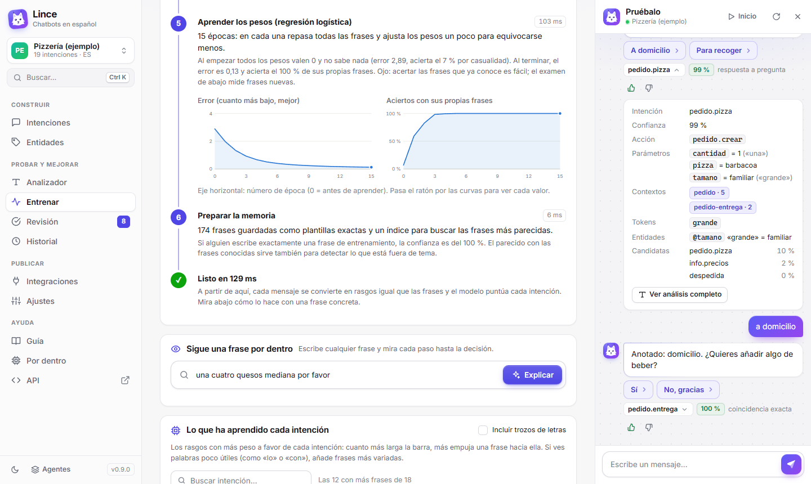
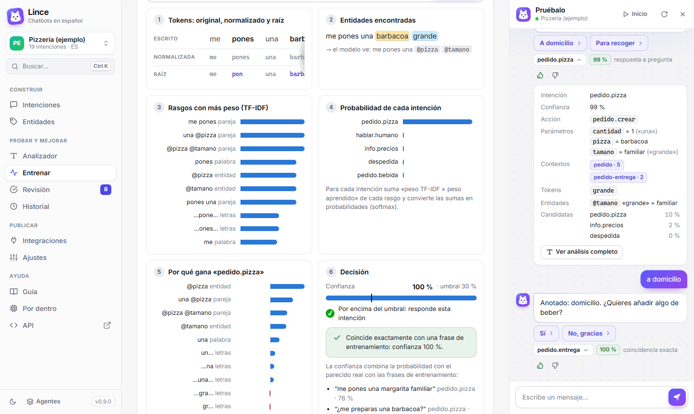
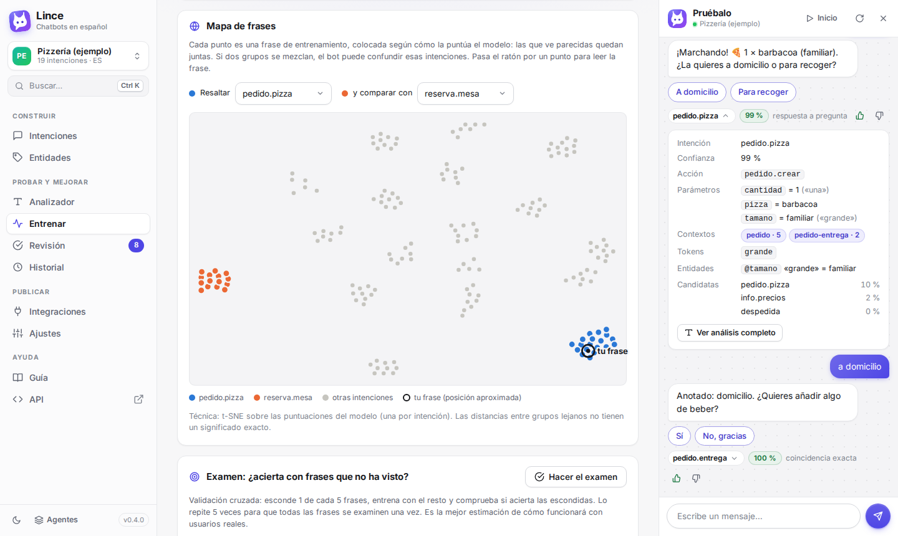
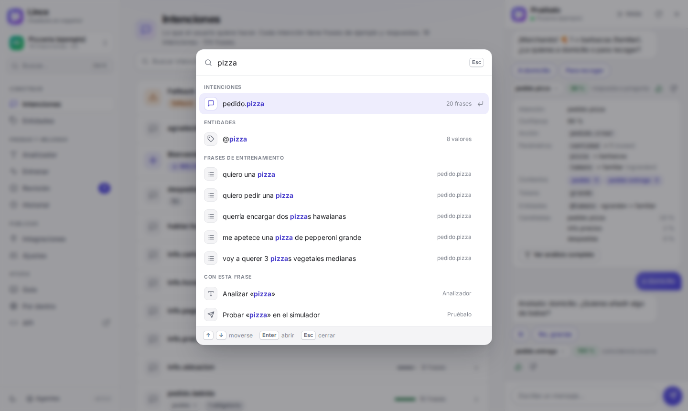

# Guía de uso

Esta guía explica cómo crear un chatbot con **Lince**, qué significa cada concepto y, sobre todo,
**cómo aprende el agente** cuando lo entrenas. Si vienes de Dialogflow, casi todo te sonará: los
conceptos son los mismos.

> **Consejo:** mientras lees, ten abierta la consola. La página **Entrenar** enseña paso a paso,
> con gráficos, todo lo que se explica en la sección «Cómo aprende el agente».

## Primeros pasos

1. **Arranca la aplicación** con doble clic en `iniciar.bat` (Windows) o `./iniciar.sh`
   (Linux/macOS). Si es la primera vez, sigue la
   [instalación en Windows, paso a paso](https://github.com/pablomise004/agenteconversacional#instalación-en-windows-paso-a-paso).
   Se abre <http://localhost:8000> en la lista de agentes: arriba, **Tus agentes**
   (vacío al principio) y debajo, **Ejemplos**, con la **Pizzería** y el **Hotel**. Entra en la
   Pizzería.
2. **Habla con él** en el panel **Pruébalo** (a la derecha): «hola», «quiero una pizza»,
   «barbacoa», «grande». Verás que pregunta lo que falta y recuerda lo que ya le has dicho.
3. **Mira qué ha entendido**: pulsa el nombre de la intención que aparece bajo cada respuesta.
4. **Corrígelo** cuando se equivoque: 👎 y eliges la intención correcta. Aprende al instante.
5. **Crea tu propio agente** en *Agentes → Crear agente* y empieza por 3 o 4 intenciones. También
   puedes empezar con una *Copia de un agente*: de uno tuyo o de un ejemplo, con todo lo que tiene.
6. **Muévete con Ctrl+K**: abre el buscador para saltar a cualquier pantalla, intención o entidad.

### Los dos agentes de ejemplo

- **Pizzería**: pequeña (19 intenciones) y fácil de seguir. Es la mejor para aprender: en la
  página Entrenar se ve claro qué palabras pesan en cada intención.
- **Hotel**: Mira, la recepcionista virtual del Hotel Mirador. Es grande (88 intenciones y más de
  2.000 frases) y enseña hasta dónde se puede llegar: reservas con resumen y confirmación,
  cambios («mejor para 3 personas») y cancelación usando contextos, peticiones a la habitación,
  averías, quejas, spa, restaurante, traslados, turismo y charla. Prueba frases como «quiero una
  suite del 3 al 6 de diciembre para 2 personas», «no se enciende la tele de la 215» o «¿me
  subís dos toallas y una almohada a la 310?». Y frases que no tienen nada que ver: sabe decir
  que eso no lo sabe.

Los ejemplos se pueden abrir, probar y cambiar como cualquier agente. Si borras uno no vuelve a
aparecer al reiniciar, pero puedes crear una copia del original cuando quieras en *Agentes → Crear
agente → Copia de un agente*. Esa copia (o un duplicado) ya es tuya y sale arriba, en *Tus agentes*.

### En la web de internet: tu cuenta y compartir

En la versión de internet (<https://linceflow.duckdns.org>) cada uno entra con su **usuario y
contraseña** y solo ve sus agentes. En la portada, la primera vez pulsa **Crear cuenta**; después
entras con tu usuario desde cualquier ordenador o móvil (y, mientras no salgas, ese navegador te
lleva directo a tus agentes). Tu nombre sale abajo a la izquierda: ahí puedes cambiar
la contraseña o salir.

Si solo quieres probarlo, pulsa **Entrar sin cuenta**. Funciona igual, pero tus agentes **solo se ven
en ese navegador**: si borras sus datos o entras desde otro ordenador, no los verás. Para llevarte un
agente, expórtalo (*Ajustes → Exportar*) e impórtalo en el otro sitio (*Agentes → Importar*). Y si
luego te decides, abajo a la izquierda, en **Sin cuenta → Crear una cuenta y guardarlos**, la cuenta
se queda con todo lo que tenías.

En Chrome o Edge puedes **instalarla como aplicación** (botón *Instalar* de la barra de direcciones):
se abre en su propia ventana, con el icono del lince. Si se pierde la conexión con el servidor, sale una
página que lo explica y un botón para volver a intentarlo.

Para **pasarle un agente a alguien**: ábrelo, ve a **Compartir** (en el menú de la izquierda) y pulsa
**Crear un enlace**. Quien lo abra puede guardar **una copia suya** en su cuenta (lo que cambie no toca el tuyo)
o descargarla para Lince instalado en su ordenador (*Agentes → Importar*). Si cambias el agente,
pulsa **Actualizar con los cambios** para que el enlace los lleve; **Dejar de compartir** lo quita.

Con Lince instalado en tu ordenador no hay cuentas: todo es tuyo y se guarda en la carpeta `data`.

## Los conceptos

### Agente

El chatbot completo. Cada agente tiene sus intenciones, entidades, ajustes y conversaciones.
Puedes tener varios (uno por proyecto) y exportarlos o importarlos como JSON.

### Intención

Lo que quiere conseguir el usuario: *pedir una pizza*, *reservar mesa*, *saber el horario*.
Cada intención tiene:

- **Frases de entrenamiento**: ejemplos de cómo lo diría la gente. Con ellas aprende.
- **Parámetros**: datos que hay que sacar de la frase (qué pizza, de qué tamaño).
- **Respuestas**: lo que contesta el bot (puede haber varias variantes; elige una al azar).
- **Contextos** y **eventos** (más abajo).

### Frase de entrenamiento

Un ejemplo real de cómo se pide algo: «me pones una margarita familiar», «quiero pedir pizza».
Cuantas más y más variadas, mejor: **apunta a 10-20 por intención**. No hace falta escribir
todas las combinaciones de palabras; el agente generaliza.

### Entidad

Un tipo de dato que aparece dentro de las frases:

- **Del sistema** (ya vienen hechas): `@sys.number` (12, doce), `@sys.date` (mañana, el lunes,
  15 de marzo), `@sys.time` (a las 5, 17:30), `@sys.duration`, `@sys.unit-currency` (20 €),
  `@sys.email`, `@sys.phone-number`, `@sys.url`, `@sys.any` (cualquier texto)…
- **Propias**: las defines tú. Por ejemplo `@pizza` con los valores *margarita*, *barbacoa*…
  Cada valor puede tener **sinónimos**: «familiar» ← «grande», «XL», «enorme».

El agente reconoce las entidades aunque estén en plural, en otro género o con alguna falta
(«pizas barbacoa familiares»).

### Parámetro

Es el valor de una entidad que se queda guardado al entender la frase. En «una barbacoa
grande», el parámetro `pizza` vale *barbacoa* y `tamano` vale *familiar* (el valor de
referencia del sinónimo «grande»).

- Se crean solos al **anotar** una entidad en una frase (seleccionas la palabra con el ratón).
- Si un parámetro es **obligatorio** y el usuario no lo ha dicho, el bot lo **pregunta** con
  las preguntas que hayas escrito. Esto se llama *slot filling*.
- En las respuestas se usan así: `$pizza`, `$fecha` (se escribe bonito: «viernes 2 de octubre»),
  `$fecha.original` (lo que escribió el usuario: «pasado mañana»).

### Contexto

La memoria a corto plazo de la conversación. Sirve para que una intención **solo** se active
después de otra:

- La intención *pedido.pizza* tiene un **contexto de salida** `pedido-entrega` que dura 2 turnos.
- La intención *pedido.entrega* («a domicilio», «para recoger») tiene ese contexto como
  **contexto de entrada**: solo puede activarse mientras esté vivo.

Así, un «sí» o un «no» suelto se entiende según lo que se acaba de preguntar. El número de un
contexto de salida es cuántos turnos dura (0 = borrarlo).

### Evento

Activa una intención sin texto. El más habitual es `WELCOME`: se lanza cuando alguien abre el
chat, para que el bot salude primero.

### Fallback

La intención que responde cuando el bot **no entiende** la frase («Perdona, no te he
entendido…»). Sus frases de entrenamiento son **ejemplos negativos**: cosas que NO deben
confundirse con otra intención (por ejemplo, «reservar un vuelo» en una pizzería).

### Umbral de confianza

Cada vez que el agente elige una intención calcula una **confianza** entre 0 y 1. Si queda por
debajo del umbral (por defecto **0,30**, en *Ajustes*), responde el fallback. Súbelo si
prefieres que diga «no te he entendido» antes que equivocarse; bájalo si es demasiado prudente.

## Cómo entiende una frase

Cuando alguien escribe, la frase pasa por estos pasos (puedes verlos todos en el **Analizador**;
y si quieres las fórmulas de cada uno, en la página **Por dentro**):

| Paso | Qué hace | Ejemplo con «Me pones 2 pizas barbacoa xfa» |
|---|---|---|
| 1. Tokenizar | Separa las palabras y signos, guardando su posición | me · pones · 2 · pizas · barbacoa · xfa |
| 2. Normalizar | Minúsculas, sin tildes, abreviaturas de chat y tus reglas | xfa → por favor |
| 3. Corregir faltas | Compara con las palabras que conoce el agente | pizas → pizzas |
| 4. Raíces | Reduce cada palabra a su raíz para que cuenten igual sus variantes | pones → pon, pizzas → pizz |
| 5. Entidades | Busca fechas, números y tus entidades | 2 = `@sys.number`, barbacoa = `@pizza` |
| 6. Rasgos | Convierte la frase en una lista de rasgos con peso | «pon», «pizz», «@pizza», «pon pizz»… |
| 7. Clasificar | Puntúa cada intención y elige la más probable | *pedido.pizza* 96 % |
| 8. Parámetros | Saca los valores para la intención elegida | cantidad = 2, pizza = barbacoa |
| 9. Diálogo | Contextos, preguntas pendientes y respuesta | «¿De qué tamaño la quieres?» |

## Cómo aprende el agente

Esta es la parte interesante. «Entrenar» significa construir, a partir de tus frases de
ejemplo, un **modelo** capaz de puntuar frases nuevas que nunca ha visto. El agente se
reentrena solo cada vez que guardas un cambio; en la página **Entrenar** puedes lanzarlo a mano
y verlo paso a paso.

### Los seis pasos del entrenamiento

1. **Reunir los ejemplos.** Junta todas las frases de entrenamiento con su intención. Las del
   fallback se guardan como ejemplos negativos.
2. **Trocear y normalizar.** Cada frase pasa por los pasos 1-4 de la tabla anterior.
3. **Marcar las entidades.** Lo anotado como entidad se sustituye por su tipo: «una barbacoa»
   y «una hawaiana» se convierten en «una @pizza». Así el modelo aprende la **estructura** de la
   frase y no cada valor por separado.
4. **Convertir cada frase en números.** Cada frase se transforma en una lista de **rasgos**:
   - palabras (su raíz): «reserv», «mesa»
   - parejas de palabras seguidas: «quiero reservar», «mesa para»
   - entidades: «@sys.date»
   - trozos de 3-4 letras («…serv…»), que ayudan con las faltas de ortografía.

   Cada rasgo recibe un peso **TF-IDF**: pesa más cuantas **menos intenciones** lo usan.
   «quiero» aparece en muchas intenciones y apenas cuenta; «reservar» aparece solo en una,
   así que es una pista muy fuerte.
5. **Aprender los pesos** (regresión logística, la parte de *machine learning*). El modelo tiene
   un peso por cada combinación de rasgo e intención. Al principio todos valen 0. Luego da
   varias vueltas (**épocas**) a las frases; con cada frase:
   - calcula la puntuación de cada intención sumando los pesos de los rasgos de la frase,
   - convierte las puntuaciones en probabilidades (función *softmax*),
   - compara con la intención correcta y **ajusta un poco los pesos** para que la próxima vez
     la probabilidad de la correcta sea mayor y la de las demás menor.

   El **error** (entropía cruzada) mide lo lejos que está de acertar con seguridad. En la
   página Entrenar verás la curva: empieza alto (no sabe nada) y baja época a época.

   
6. **Preparar la memoria.** Guarda cada frase como **plantilla exacta** (si alguien escribe
   justo una frase de entrenamiento, la confianza es 100 %) y un índice para encontrar las
   frases más parecidas a cualquier mensaje nuevo.

### Cómo decide con una frase nueva

1. La convierte en rasgos igual que las frases de entrenamiento (los rasgos que nunca ha visto
   se ignoran).
2. Para cada intención suma *peso TF-IDF del rasgo × peso aprendido*. La página Entrenar
   muestra estas aportaciones: barras azules las que **empujan** hacia la intención y rojas las
   que **restan**.
3. Convierte las sumas en probabilidades y elige la más probable.
4. Calcula la **confianza**: la probabilidad, moderada por cuánto se parece de verdad la frase
   a las de entrenamiento. Sin esto, una frase sin relación («¿cuál es la capital de
   Francia?») podría salir con mucha probabilidad simplemente porque hay pocas intenciones
   donde elegir.
5. Si una intención espera un **contexto** que está activo, tiene prioridad.
6. Si la confianza no llega al umbral, responde el fallback.

### ¿Ha aprendido bien? El examen

Que el agente acierte sus propias frases no demuestra nada: se las sabe de memoria. Lo que
importa es cómo funciona con **frases nuevas**. El **examen** de la página Entrenar hace una
**validación cruzada**:

1. Esconde 1 de cada 5 frases.
2. Entrena con el resto.
3. Comprueba cuántas de las escondidas acierta.
4. Repite cinco veces, para que todas las frases se examinen una vez.

Además te dice **qué frases falla** y **con qué intención las confunde** (la matriz de
confusión).

Es una estimación **prudente**. Si una frase escondida era la única de su estilo, el modelo
duda, se queda por debajo del umbral y la cuenta como fallo aunque eligiera bien la intención.
En agentes con frases muy variadas pasa mucho: el hotel saca un 65 % en el examen, pero con
frases nuevas escritas por personas acierta 9 de cada 10. Lo útil del examen es **comparar**:
si cambias algo y la nota sube, vas bien; y las intenciones de abajo de la tabla son las que
piden más frases.

> Un examen bajo en una intención casi siempre significa que necesita **más frases y más
> variadas**. Si dos intenciones se confunden entre sí, sus frases se parecen demasiado:
> cámbialas o separa el flujo con contextos.

### El mapa de frases

En la página Entrenar cada frase de entrenamiento es un punto, colocado según cómo la puntúa el
modelo: las que el modelo ve parecidas quedan juntas (técnica *t-SNE*). Puedes resaltar dos
intenciones para ver si sus grupos están separados (bien) o mezclados (se confundirán). Tu
frase de prueba aparece marcada para ver en qué zona cae.

## Consejos para entrenar bien

- **10-20 frases por intención**, variadas: distintos verbos, órdenes, formal e informal,
  cortas y largas. «Quiero reservar», «¿tenéis mesa?», «reserva para dos el viernes».
- **No repitas la misma frase en dos intenciones** (la página de intenciones avisa).
- **Anota las entidades siempre igual.** Si en una frase marcas «el sábado» como fecha,
  márcalo también en las demás.
- **Usa entidades en vez de listas de frases.** Mejor «quiero una @pizza» con la entidad bien
  rellena que veinte frases, una por pizza.
- **Añade ejemplos negativos al fallback** para cosas que se parecen pero no son lo tuyo
  («reservar un vuelo», «comprar un coche»).
- **Revisa las conversaciones reales** en *Revisión*: lo que escribe la gente de verdad es el
  mejor material de entrenamiento.
- **Haz el examen** de vez en cuando y fíjate en las intenciones con peor acierto.
- **Pide a otra persona que escriba cómo lo diría.** Las frases que escribes tú se parecen entre
  sí; las de otros sacan los huecos de verdad («¿hay algún súper cerca?», «gotea el grifo»).
  Así se afinó el agente del hotel: cada ronda de frases nuevas, sus fallos se añadieron como
  frases de entrenamiento.

## Diseñar conversaciones

### Pedir los datos que faltan

Marca un parámetro como **obligatorio** y escribe una o varias preguntas. Si el usuario dice
«quiero una pizza», el bot preguntará «¿Qué pizza te apetece?» y esperará la respuesta. Si
dice «olvídalo» o «cancelar», abandona la pregunta; si cambia de tema claramente, atiende lo
nuevo.

### Preguntas de sí o no

1. En la intención que pregunta («¿Quieres algo de beber?») añade un **contexto de salida**,
   por ejemplo `pedido-bebida` con duración 2.
2. Crea dos intenciones, «sí» y «no», con `pedido-bebida` como **contexto de entrada** y frases
   como «sí», «vale», «claro» / «no», «no gracias».

Fuera de ese momento, un «sí» suelto no las activará.

### Respuestas dinámicas (webhook)

Para consultar una base de datos, el estado de un pedido o cualquier cosa variable, configura
un **webhook** en *Ajustes* y actívalo en la intención. Recibe la misma petición que mandaría
Dialogflow (intención, parámetros, contextos) y puede devolver el texto de la respuesta. La
página *Integraciones* tiene ejemplos en Python y Node.js.

## Las pantallas de la consola

| Pantalla | Para qué sirve |
|---|---|
| **Intenciones** | Crear y editar intenciones: frases (selecciona texto para anotar entidades), parámetros, respuestas, contextos, eventos y webhook |
| **Entidades** | Tus entidades con sus valores y sinónimos; edición masiva tipo CSV; lista de entidades del sistema |
| **Analizador** | Ver cómo entiende una frase (tokens, entidades, intenciones candidatas, frases parecidas) y corregirlo: intención, anotaciones, sinónimos y reglas de normalización |
| **Entrenar** | Ver el entrenamiento paso a paso, la curva de aprendizaje, qué ha aprendido cada intención, el mapa de frases y el examen |
| **Por dentro** | Cómo funciona el motor por dentro, con las fórmulas matemáticas y gráficos calculados con una frase tuya (en *Ayuda*, junto a esta guía) |
| **Revisión** | Los mensajes reales de los usuarios: apruébalos o corrígelos para que se conviertan en frases de entrenamiento |
| **Historial** | Las conversaciones completas, estadísticas de uso y la actividad de cada día |
| **Integraciones** | Código para poner el chat en una web (con vista previa del color, la posición y el tema claro, oscuro o automático), usar la API o un webhook |
| **Ajustes** | Umbral, corrección ortográfica, reglas de normalización, webhook, clave de API, exportar y borrar |
| **Pruébalo** | El chat de la derecha, con detalles de cada turno y botones 👍/👎 |
| **Buscar** (Ctrl+K) | Salta a cualquier pantalla, intención o entidad. Si escribes una frase, te ofrece analizarla, probarla en el chat o explicarla paso a paso |
| **API** | La referencia de la API (`/docs`): cada ruta explicada, con ejemplos y un botón *Pruébalo* que envía la petición de verdad |
| **Novedades** | Pulsa el número de versión (abajo a la izquierda) para ver qué trae cada versión. Un punto en el número avisa de que hay novedades sin ver |

### Atajos de teclado

| Atajo | Qué hace |
|---|---|
| Ctrl+K (⌘K en Mac) | Abre el buscador |
| Ctrl+S | Guarda la intención, la entidad o los ajustes que estás editando |
| ↑ ↓ y Enter | Moverse por las listas del buscador y de las entidades, y elegir |
| Esc | Cierra ventanas, menús y el buscador |
| / | En la referencia de la API, salta al buscador |

En las tablas, pulsa el título de una columna para **ordenarla** (otra vez para invertir el orden).
Al pasar el ratón por un botón o una marca aparece una pequeña explicación. En las páginas largas
(esta guía y *Por dentro*), con poco sitio (en el móvil o con el chat abierto) el índice es una barra
arriba que dice en qué sección estás; púlsala para saltar a otra.

## Problemas frecuentes

**No entiende una frase que debería entender.** Ábrela en el *Analizador*. Mira si los tokens y
las entidades son correctos y qué intención se le parece. Pulsa «No, corregir», elige la
intención y guárdala: ya la tendrá en cuenta.

**Confunde dos intenciones.** Haz el examen en *Entrenar* y mira la matriz de confusión. Resalta
las dos intenciones en el mapa: si sus puntos están mezclados, sus frases se parecen demasiado.

**Responde cosas que no son de su tema.** Añade esas frases al fallback como ejemplos negativos
(👎 → elegir el fallback) o sube un poco el umbral.

**Lee mal una palabra** (jerga, abreviaturas, errores típicos). En el *Analizador*, «¿Ha
tokenizado algo mal?», añade una regla: «pizzeta» → «pizza».

**«a las 5» lo entiende como las 17:00.** Las horas de 1 a 7 sin «de la mañana» se interpretan
como tarde, que es lo más habitual en una conversación; de 8 a 12 se dejan tal cual. Si
necesitas otra cosa, pregunta «¿de la mañana o de la tarde?».

**Una entidad no reconoce un valor.** Añade el valor o un sinónimo en *Entidades*, o desde el
Analizador al anotar la palabra («Añadir sinónimo»).

**Aparece «Reinicia el servidor para terminar de actualizar».** Has actualizado el programa con el
servidor en marcha: la consola ya es la nueva, pero el servidor sigue con el código anterior (por
ejemplo, la referencia de la API se ve antigua). Cierra la ventana del servidor (o pulsa Ctrl+C en
ella) y vuelve a abrir `iniciar.bat`.

## Glosario

| Término | Significado |
|---|---|
| Token | Cada trozo en que se divide una frase (palabra, número, signo) |
| Normalizar | Pasar a minúsculas, quitar tildes y expandir abreviaturas |
| Raíz (stem) | La parte común de una palabra y sus variantes: reserv-ar, reserv-a |
| Rasgo (feature) | Cada pista que el modelo usa: una raíz, una pareja de palabras, una entidad, un trozo de letras |
| TF-IDF | Forma de dar más peso a los rasgos poco comunes entre intenciones |
| Regresión logística | El modelo de *machine learning* que aprende un peso por rasgo e intención |
| Época | Una vuelta completa del entrenamiento a todas las frases |
| Error / pérdida | Cuánto se equivoca el modelo; baja durante el entrenamiento |
| Softmax | Fórmula que convierte puntuaciones en probabilidades que suman 1 |
| Confianza | Probabilidad ajustada por el parecido con las frases conocidas |
| Validación cruzada | Examen con frases escondidas para medir el acierto real |
| Sobreajuste | Saberse de memoria las frases de entrenamiento sin generalizar a frases nuevas |
| Slot filling | Preguntar los parámetros obligatorios que faltan |
| Webhook | Tu propio servidor, al que el agente llama para dar respuestas dinámicas |
